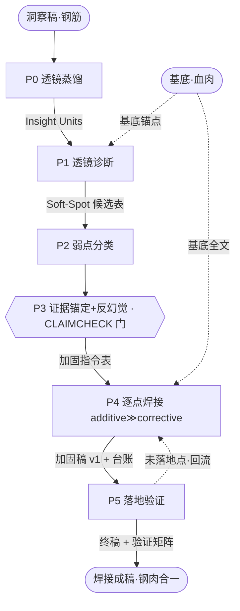

# Pipeline 阶段详解 P0–P5

> 五步加固骨架（`透镜诊断 → 弱点分类 → 类型映射动作 → 逐点焊接 → 落地验证`，由 Flower-Hayes 认知模型 + ODC + CMMI-CAR 三领域独立收敛）落地为 6 个串行阶段：前置 P0「透镜蒸馏」剪枝纯化，末端把「焊接」与「落地验证」拆成 P4/P5 以各设质量门。

> **2-run 软编排切分**（v2.0）：**P0-P3 = RUN-1 诊断 team**（末端 evidence-anchor 含 G1 + gate-prep 打 escalation，落审定门三件套）→【Hermes 自核审定门】→ **P4-P5 = RUN-2 焊接 team**。审定门把诊断与焊接切到两个 fresh team，天然保住 B→C 透镜外置。编排细节见 `team-orchestration.md`。

## 阶段表

| # | 阶段 | 输入 | 动作 | 交接产物 | 映射五步 | 文献 |
|---|---|---|---|---|---|---|
| **P0** | 透镜蒸馏 Lens Distill | 洞察稿(原始) | 蒸馏成「紧凑知识单元」：去冗、概念化、按承重相关性排序 | Insight Units 表 | 前置 | 剪枝纯化 arXiv:2311.01150 |
| **P1** | 透镜诊断 Lens Diagnosis | 基底 + Insight Units | 以洞察单元为外部透镜逐条扫基底，定位承重论点软处 | Soft-Spot 候选表(含基底锚点) | ① 透镜诊断 | Constitutional AI；Flower-Hayes Detection |
| **P2** | 弱点分类 Classification | Soft-Spot 候选表 | 打 Faigley-Witte 四象限标 + additive/corrective 标 | 分类后软处表 | ② 弱点分类 | Faigley & Witte 1981；IteraTeR |
| **P3** | 证据锚定 + 反幻觉 | 分类表 + 基底原文 + 洞察稿 | 映射加固动作绑证据锚；**焊回前剔除「批评点本身无据」的幻觉软处** | 加固指令表(过 G1) + 幻觉日志 | ③(前半) | CRITIC + CLAIMCHECK |
| **P4** | 逐点焊接 Welding | 加固指令表 + 基底全文 | 按 additive≫corrective 逐条注入，保血肉、熔钢筋 | 加固稿 v1 + point-by-point 台账 | ③④ | additive 优先；Response-to-Reviewers；ODC |
| **P5** | 落地验证 Verification | 加固稿 v1 + 台账 + 指令表 | 逐条核验洞察是否真注入(Critique Utility) + 宏观一致性二次检测；未落地回流 P4 | 终稿 + 验证矩阵报告 | ⑤ 落地验证 | RCO + Fagan Follow-up；Flower-Hayes 二次 Detection |

## 衔接物链（每个产物都是结构化表 = point-by-point 追溯链物理载体）

```
洞察稿 →[P0]→ Insight Units →[P1]→ Soft-Spot 候选表 →[P2]→ 分类后软处表
       →[P3]→ 加固指令表 →[P4]→ 加固稿 v1 + 台账 →[P5]→ 终稿
```

## 流程图



> Quick 档把 P0+P1+P2 合并为单 agent、P3 简化；但 **P0 蒸馏 + P5 验证全档保留**（即使合并）——剪枝纯化与落地验证是本方法论区别于「粗暴 merge」的本质。
