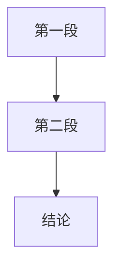

<!-- 用途说明：视频解析报告的标准输出模板，定义所有必需章节和格式规范。生成报告时加载。 -->

# Bilibili 视频解析输出模板

## 文件名格式

遵循 vault `CLAUDE.md` 事件型笔记规范：

`B站笔记_[主题简述]_YYYYMMDD.md`

> 示例：`B站笔记_Niuma语音Agent_20260607.md`
> 
> ⚠️ 不使用旧格式 `视频解析_...`。

## YAML Frontmatter（必填）

> ⚠️ 每篇报告必须包含 YAML frontmatter，遵循 Obsidian CLAUDE.md 规范。类型字段固定为 `视频笔记`。

```yaml
---
status: 常青
type: 视频笔记
priority: 正常
aliases: [English title, 关键词1, 关键词2]
tags: [ai/hermes, type/视频笔记, topic/技术]
created: YYYY-MM-DD HH:MM
modified: YYYY-MM-DD HH:MM
---
```

| 字段 | 值 | 说明 |
|:---|:---|:---|
| `status` | 常青 | B站笔记一般视为常青（长期可查） |
| `type` | 视频笔记 | 固定值，不按视频类型变化 |
| `priority` | 正常 | 极少情况用"重要" |
| `aliases` | 2-4个 | 1个英文标题 + 2-3个中文关键词 |
| `tags` | 3-5个 | 主标签 `ai/hermes` 按视频主题调整；`type/视频笔记` 固定 |

---

## 0. 元信息 (Meta)

| 维度 | 内容 |
|:---|:---|
| 全标题 | [视频原标题，完整复制] |
| 一句话价值 | [核心痛点/价值] (50字内，直击要害) |
| 视频类型 | [教程/访谈/评测/叙事/演讲] |
| 作者/频道 | [名称] (<50字简介) |
| 源链接 | [完整URL] |
| 时长/播放量/发布时间 | [XX分钟 / X万播放 / YYYY-MM-DD] |
| 分析样本 | 字幕: X条 / 弹幕: Y条 / 评论: Z条 |

---

## 1. 逻辑链 (Logic Chain)

> [!abstract]- 叙事策略
> 一句话概括视频的叙事结构（如「个人故事 → 痛点 → 技术方案 → 愿景」）。

### 视频一叙事弧线 (如果需要合并多视频，每视频独立一节)

| # | 段落 | 时间 | 核心内容 | 叙事功能 |
|:--|:-----|:-----|:---------|:---------|
| 1 | 🏷️ 段落名 | `MM:SS–MM:SS` | 一句话核心内容 | 在叙事中的角色（情感锚点/转折/方案亮相/干货） |
| 2 | ... | ... | ... | ... |



> [!tip] 格式约束
> - 逻辑链用 **表格 + Mermaid 流程图**，不用大段叙事散文
> - 整体 ≤100 行（含流程图），避免臃肿
> - 逐字引述下沉到 §3 核心洞察或 §4 Deep Dive
> - 赞助内容压缩为表格中一行，不单独展开分析

---

## 2. 弹幕深度分析 (Danmaku Intelligence)

### 2.1 情绪图谱
| 情绪类型 | 占比 | 典型弹幕 | 出现时段 | 解读 |
|:---|:---:|:---|:---|:---|
| 共鸣/认同 | X% | "..." | `MM:SS` | ... |
| 焦虑/FOMO | X% | "..." | `MM:SS` | ... |
| 调侃/玩梗 | X% | "..." | `MM:SS` | ... |
| 质疑/担忧 | X% | "..." | `MM:SS` | ... |
| 困惑/求解 | X% | "..." | `MM:SS` | ... |

### 2.2 弹幕关键词云
- **高频词** (≥3次): ...
- **文化梗**: ...
- **争议焦点**: ...

### 2.3 弹幕-内容互动图谱
| 视频内容 | 时间戳 | 弹幕反应 | 类型 | 分析 |
|:---|:---|:---|:---|:---|
| ... | `MM:SS` | "..." | [类型] | ... |

### 2.4 关键发现
1. **核心争议**: ...
2. **文化共鸣**: ...
3. **认知落差**: ...
4. **未满足期待**: ...

---

## 2.5 评论深度分析 (Comments Analysis)

### 2.5.1 评论概览
| 维度 | 数据 |
|:---|:---|
| 总评论数 | X条 |
| 总回复数 | X条 |
| 分析样本 | 前X条热评 |
| 最高点赞 | X赞 |
| UP主回复数 | X条 |

### 2.5.2 热评精选 (Top Comments)

#### 🏆 热评一：[用户名] 👍X
> "评论原文（前200字）..."
> 
> **背景**: 该评论在什么情境下产生？
> **观点**: 核心论点是什么？
> **价值**: 是否提供了视频外的信息增量？
> **与弹幕对比**: 弹幕对此话题的反应如何？

#### 🏆 热评二：[用户名] 👍X
...

#### 🏆 热评三：[用户名] 👍X
...

### 2.5.3 评论观点聚合
| 观点类型 | 代表评论 | 点赞数 | 与视频关系 |
|:---|:---|:---:|:---|
| 补充信息 | ... | X | 提供了视频未提及的细节 |
| 深度分析 | ... | X | 对视频内容的延伸思考 |
| 情感共鸣 | ... | X | 情绪表达为主 |
| 质疑反驳 | ... | X | 与视频观点不一致 |
| 玩梗造句 | ... | X | 娱乐性质 |

### 2.5.4 弹幕 vs 评论对比分析
| 话题 | 弹幕反应 | 评论反应 | 差异分析 |
|:---|:---|:---|:---|
| [话题A] | 情绪/玩梗 | 理性分析 | 弹幕即时，评论深思 |
| [话题B] | 困惑质疑 | 解答补充 | 评论形成知识互补 |

### 2.5.5 评论关键发现
1. **信息增量**: 评论是否提供了视频未提及的重要信息？
2. **深度延伸**: 是否有专业观众进行了更深层的分析？
3. **UP主互动**: UP主通过评论回复传达了哪些额外信息？
4. **舆论修正**: 评论是否纠正了弹幕中的误解？

---

## 3. 核心洞察 (Key Insights)

### 💡 洞察一: [概念 (English)]
- **定义**: ...
- **深度解析**: 原理+案例+关联
- **弹幕反馈**: 反应类型 + 典型弹幕 + 共识度
- **定位**: `MM:SS` ▸ [URL]

### 💡 洞察二: [概念 (English)]
...

### 💡 洞察三: [概念 (English)]
...

### 🔥 反直觉/争议点
- **描述**: ...
- **视频立场**: ...
- **弹幕反驳**: ...
- **个人判断**: ...
- **定位**: `MM:SS` ▸ [URL]

---

## 4. 内容深度拆解 (Deep Dive)

> [!tip] 模块可扩展
> 全量版 ≥3 模块，可根据用户要求增加（如「加一个板块研究 Codex」）。每个模块 500-1000 字，必须包含至少一张 Mermaid 图（flowchart / sequence / pie）。模块间应形成互补——不要 3 个模块讲同一件事。

### 模块 1: [标题]
- **核心论点**: 一句话
- **Mermaid 图**: 架构/流程/对比/时序，按模块主题选择最合适的图表类型
- **论证展开**: 前提→推理→结论，附逐字引述支撑
- **与用户栈的关联**: 如果用户有相关技术栈（如 Hermes、飞书），指出可借鉴/不可借鉴之处
- **批判审视**: 漏洞/遗漏/前提假设

### 模块 2: [标题]
...

---

## 5. 高光时刻 (Highlights & Quotes)

### 视频金句
> "[原文]"
> 
> **上下文**: ...
> **解读**: ...
> **定位**: `MM:SS` ▸ [URL]

### 弹幕金句
> "[原文]"
> 
> **反映心态**: ...
> **文化背景**: ...
> **出现时机**: ...

---

## 6. 知识图谱 (Knowledge Graph)

### 核心概念
| 概念 (CN/EN) | 定义 | 关联 | 位置 |
|:---|:---|:---|:---|
| ... | ... | ... | `MM:SS` |

### 工具/资源
| 名称 | 类型 | 用途 | 用法 |
|:---|:---|:---|:---|
| ... | ... | ... | `MM:SS` |

### 提及人物
| 姓名 | 身份 | 关系 | 引用 |
|:---|:---|:---|:---|
| ... | ... | ... | `MM:SS` |

### 文化梗/弹幕用语
| 用语 | 含义 | 来源 | 场景 |
|:---|:---|:---|:---|
| ... | ... | ... | `MM:SS` |

---

## 7. 批判与行动 (Critical Review & Action)

### 独特价值
- [价值点1]: ...
- [价值点2]: ...

### 局限与偏见
- [局限1]: ...
- [局限2]: ...

### 弹幕共识度分析
| 观点 | 赞同% | 质疑% | 共识度 | 说明 |
|:---|:---:|:---:|:---:|:---|
| ... | X% | Y% | [高/中/低] | ... |

### 可行动项
**立即执行 (Today)**:
1. [ ]
2. [ ]

**短期跟进 (This Week)**:
1. [ ]
2. [ ]

**长期探索 (This Month)**:
1. [ ]
2. [ ]

**风险提示**:
- ⚠️ ...

---

## 8. 附录 (Appendix)

### 原始资料
- 字幕文件: [路径]
- 弹幕文件: [路径]
- 评论文件: [路径]

### 延伸阅读
- [链接1]
- [链接2]

### 版本记录
- 分析时间: [YYYY-MM-DD HH:MM]
- 分析工具: ...
