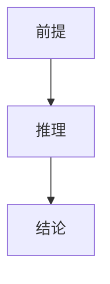

# 测试报告 (FAIL)

## 1. 逻辑链 (Logic Chain)

表层逻辑。

## 3. 核心洞察 (Key Insights)

### 💡 洞察1: 测试概念 (TestConcept1)
- **定义**: 本洞察用于校验 G3 门槛。本洞察用于校验 G3 门槛。本洞察用于校验 G3 门
- **定位**: `01:23` ▸ [URL](https://b.tv?t=83)

## 4. 内容深度拆解 (Deep Dive)

### 模块 1: 测试模块标题
- **核心论点**: 本模块论证展开用于校验 G4 深度门槛要求。本模块论证展开用于校验 G4 深度门槛要求。本模块论证展开用于校验 G4 深度门槛要求。本模块论证展开用于校验 G4

## 5. 高光时刻 (Highlights & Quotes)

> "这是第1条测试金句原文。"
>
> **解读**: 用于校验 G5 高光数量门槛。

> "这是第2条测试金句原文。"
>
> **解读**: 用于校验 G5 高光数量门槛。

## 7. 批判与行动 (Critical Review & Action)

### 独特价值
- 仅一个价值。

### 局限与偏见
- 仅一个局限。

### 可行动项
1. 仅一项。
