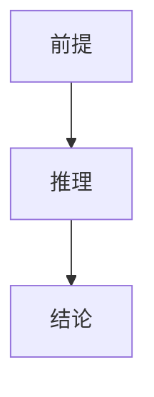

# 测试报告 (PASS)

## 0. 元信息 (Meta)

| 维度 | 内容 |
|:--|:--|
| 全标题 | 测试 |

## 1. 逻辑链 (Logic Chain)

| # | 段落 | 时间 | 核心 |
|:-|:-|:-|:-|
| 1 | 开场 | `00:00` | 引入 |

## 3. 核心洞察 (Key Insights)

### 💡 洞察1: 测试概念 (TestConcept1)
- **定义**: 本洞察用于校验深度质量门槛中的核心洞察字数要求并提供充分的中文正文内容本洞察用于校验深度质量门槛中的核心洞察字数要求并提供充分的中文正文内容本洞察用于校验深度质量门槛中的核心洞察字数要求并提供充分的中文正文内容本洞察用于校验深度质量门槛中的核心洞察字数要求并提供充分的中文正文内容本洞察用于校验深度质量门槛中的核心洞察字数要求并提供充分的中文正文内容本洞察用于校验深度质量门槛中的核心洞察字数要求并提供充分的中文正文内容本洞察用于校验深度质量门槛中的核心洞察字数要求并提供充分的中文正文内容本洞察用于校验深度质量门槛中的核心洞察字数要求并提供充分的中文正文内容
- **定位**: `01:23` ▸ [URL](https://b.tv?t=83)

### 💡 洞察2: 测试概念 (TestConcept2)
- **定义**: 本洞察用于校验深度质量门槛中的核心洞察字数要求并提供充分的中文正文内容本洞察用于校验深度质量门槛中的核心洞察字数要求并提供充分的中文正文内容本洞察用于校验深度质量门槛中的核心洞察字数要求并提供充分的中文正文内容本洞察用于校验深度质量门槛中的核心洞察字数要求并提供充分的中文正文内容本洞察用于校验深度质量门槛中的核心洞察字数要求并提供充分的中文正文内容本洞察用于校验深度质量门槛中的核心洞察字数要求并提供充分的中文正文内容本洞察用于校验深度质量门槛中的核心洞察字数要求并提供充分的中文正文内容本洞察用于校验深度质量门槛中的核心洞察字数要求并提供充分的中文正文内容
- **定位**: `01:23` ▸ [URL](https://b.tv?t=83)

### 💡 洞察3: 测试概念 (TestConcept3)
- **定义**: 本洞察用于校验深度质量门槛中的核心洞察字数要求并提供充分的中文正文内容本洞察用于校验深度质量门槛中的核心洞察字数要求并提供充分的中文正文内容本洞察用于校验深度质量门槛中的核心洞察字数要求并提供充分的中文正文内容本洞察用于校验深度质量门槛中的核心洞察字数要求并提供充分的中文正文内容本洞察用于校验深度质量门槛中的核心洞察字数要求并提供充分的中文正文内容本洞察用于校验深度质量门槛中的核心洞察字数要求并提供充分的中文正文内容本洞察用于校验深度质量门槛中的核心洞察字数要求并提供充分的中文正文内容本洞察用于校验深度质量门槛中的核心洞察字数要求并提供充分的中文正文内容
- **定位**: `01:23` ▸ [URL](https://b.tv?t=83)

### 🔥 反直觉/争议点
- 这个不算洞察。

## 4. 内容深度拆解 (Deep Dive)

### 模块 1: 测试模块标题
- **核心论点**: 本模块的论证展开用于校验深度拆解模块的字数门槛前提推理结论并附充分的中文论述内容本模块的论证展开用于校验深度拆解模块的字数门槛前提推理结论并附充分的中文论述内容本模块的论证展开用于校验深度拆解模块的字数门槛前提推理结论并附充分的中文论述内容本模块的论证展开用于校验深度拆解模块的字数门槛前提推理结论并附充分的中文论述内容本模块的论证展开用于校验深度拆解模块的字数门槛前提推理结论并附充分的中文论述内容本模块的论证展开用于校验深度拆解模块的字数门槛前提推理结论并附充分的中文论述内容本模块的论证展开用于校验深度拆解模块的字数门槛前提推理结论并附充分的中文论述内容本模块的论证展开用于校验深度拆解模块的字数门槛前提推理结论并附充分的中文论述内容本模块的论证展开用于校验深度拆解模块的字数门槛前提推理结论并附充分的中文论述内容本模块的论证展开用于校验深度拆解模块的字数门槛前提推理结论并附充分的中文论述内容本模块的论证展开用于校验深度拆解模块的字数门槛前提推理结论并附充分的中文论述内容本模块的论证展开用于校验深度拆解模块的字数门槛前提推理结论并附充分的中文论述内容本模块的论证展开用于校验深度拆解模块的字数门槛前提推理结论并附充分的中文论述内容本模块的论证展开用于校验深度拆解模块的字数门槛前提推理结论并附充分的中文论述内容本模块的论证展开用于校验深度拆解模块的字数门槛前提推理结论并附充分的中文论述内容

### 模块 2: 测试模块标题
- **核心论点**: 本模块的论证展开用于校验深度拆解模块的字数门槛前提推理结论并附充分的中文论述内容本模块的论证展开用于校验深度拆解模块的字数门槛前提推理结论并附充分的中文论述内容本模块的论证展开用于校验深度拆解模块的字数门槛前提推理结论并附充分的中文论述内容本模块的论证展开用于校验深度拆解模块的字数门槛前提推理结论并附充分的中文论述内容本模块的论证展开用于校验深度拆解模块的字数门槛前提推理结论并附充分的中文论述内容本模块的论证展开用于校验深度拆解模块的字数门槛前提推理结论并附充分的中文论述内容本模块的论证展开用于校验深度拆解模块的字数门槛前提推理结论并附充分的中文论述内容本模块的论证展开用于校验深度拆解模块的字数门槛前提推理结论并附充分的中文论述内容本模块的论证展开用于校验深度拆解模块的字数门槛前提推理结论并附充分的中文论述内容本模块的论证展开用于校验深度拆解模块的字数门槛前提推理结论并附充分的中文论述内容本模块的论证展开用于校验深度拆解模块的字数门槛前提推理结论并附充分的中文论述内容本模块的论证展开用于校验深度拆解模块的字数门槛前提推理结论并附充分的中文论述内容本模块的论证展开用于校验深度拆解模块的字数门槛前提推理结论并附充分的中文论述内容本模块的论证展开用于校验深度拆解模块的字数门槛前提推理结论并附充分的中文论述内容本模块的论证展开用于校验深度拆解模块的字数门槛前提推理结论并附充分的中文论述内容

### 模块 3: 测试模块标题
- **核心论点**: 本模块的论证展开用于校验深度拆解模块的字数门槛前提推理结论并附充分的中文论述内容本模块的论证展开用于校验深度拆解模块的字数门槛前提推理结论并附充分的中文论述内容本模块的论证展开用于校验深度拆解模块的字数门槛前提推理结论并附充分的中文论述内容本模块的论证展开用于校验深度拆解模块的字数门槛前提推理结论并附充分的中文论述内容本模块的论证展开用于校验深度拆解模块的字数门槛前提推理结论并附充分的中文论述内容本模块的论证展开用于校验深度拆解模块的字数门槛前提推理结论并附充分的中文论述内容本模块的论证展开用于校验深度拆解模块的字数门槛前提推理结论并附充分的中文论述内容本模块的论证展开用于校验深度拆解模块的字数门槛前提推理结论并附充分的中文论述内容本模块的论证展开用于校验深度拆解模块的字数门槛前提推理结论并附充分的中文论述内容本模块的论证展开用于校验深度拆解模块的字数门槛前提推理结论并附充分的中文论述内容本模块的论证展开用于校验深度拆解模块的字数门槛前提推理结论并附充分的中文论述内容本模块的论证展开用于校验深度拆解模块的字数门槛前提推理结论并附充分的中文论述内容本模块的论证展开用于校验深度拆解模块的字数门槛前提推理结论并附充分的中文论述内容本模块的论证展开用于校验深度拆解模块的字数门槛前提推理结论并附充分的中文论述内容本模块的论证展开用于校验深度拆解模块的字数门槛前提推理结论并附充分的中文论述内容

## 5. 高光时刻 (Highlights & Quotes)

### 视频金句
> "这是第1条测试金句原文。"
>
> **解读**: 用于校验 G5 高光数量门槛。

> "这是第2条测试金句原文。"
>
> **解读**: 用于校验 G5 高光数量门槛。

> "这是第3条测试金句原文。"
>
> **解读**: 用于校验 G5 高光数量门槛。

### 弹幕金句
> "这是第4条测试金句原文。"
>
> **解读**: 用于校验 G5 高光数量门槛。

> "这是第5条测试金句原文。"
>
> **解读**: 用于校验 G5 高光数量门槛。

> "这是第6条测试金句原文。"
>
> **解读**: 用于校验 G5 高光数量门槛。

## 7. 批判与行动 (Critical Review & Action)

### 独特价值
- 价值点一。
- 价值点二。
- 价值点三。

### 局限与偏见
- 局限一。
- 局限二。

### 可行动项
**立即执行 (Today)**:
1. 第一项行动。
2. 第二项行动。

**短期跟进 (This Week)**:
1. 第三项行动。

## 8. 附录 (Appendix)
- 来源
