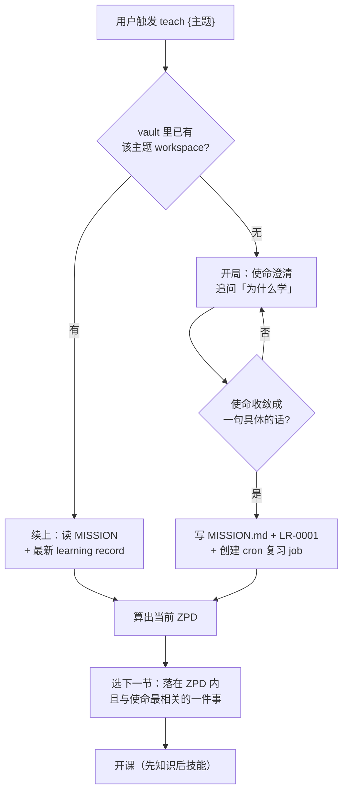

# Teach（异步教学）v0.2

为长期记忆而设计的有状态教学 skill。把「教一个人」从一问一答的无状态对话，重写成可追溯、跨会话、为储存强度服务的工程过程。**编排型 skill**：文件 IO 交给 `obsidian`，自己只管教学逻辑。

## 🚨 Red Flags — 看到自己在这么想，立即停手

| 你可能的借口 | 为什么错 → 正确动作 |
|:---|:---|
| 「用户随口问了一句，正好开课教他」 | teach 是重状态、跨会话的承诺。一次性提问走普通问答 → **只在用户表达长期/多次学习意图时才触发**。 |
| 「使命用户说得含糊，先开课边教边明确」 | 坏使命比没使命更糟，会带偏后面**所有**课程 → **先别开课**，追问「为什么学」直到收敛成一句具体的话。 |
| 「这轮聊得不错，记一条 learning record」 | 流水账会淹没信号、让 ZPD 算不准 → **只在有理解证据时写**（见「四写四不写」）。 |
| 「quiz 选项长短不一无所谓，能测就行」 | 不等长会泄露格式线索，学习者靠「最长的通常对」绕过检索，储存强度练不到 → **每个选项等长、无线索**。 |
| 「知识点多，一条消息全发给他」 | 知识阶段一次塞太多＝把新手按进水里（认知负荷爆表）→ **拆 2–4 条短消息，一条一个点**。 |
| 「用户几天没回复，催一下」 | 间隔效应是白送的认知科学利器，延迟回答＝正在巩固储存强度 → **不催、不追、不提醒**。cron 复习和用户回复是两条独立轨道。 |

## 方法论内核（30 秒锚定，详见 [[teach-skill-教学方法论]]）

**使命锚定 ＋ ZPD 校准 ＋ 困难的辩证 ＋ 理解留痕 ＋ 间隔复习 → 可迁移的长期能力**

- **流畅 ≠ 储存**：「刚学完感觉懂了」是危险信号不是成功信号。目标是几周后还能独立调出来用。
- **困难的辩证（手术刀）**：==知识获取阶段，困难是敌人==（降认知负荷、扫清障碍）；==技能获取阶段，困难是工具==（故意加阻力、逼检索）。分清当前在哪个阶段，是好老师和差老师的分水岭。
- **异步是特性不是缺陷**：用户隔很久才答题是**好事**（间隔效应＋延迟反馈，认知科学里最贵的两样，Telegram 白送）。不要因延迟而催促。
- **cron 间隔复习**：被动等用户来复习 → 遗忘。主动按遗忘曲线推送间隔复习 → 储存强度持续攀升。cron 只管推送，不管批改——用户回复后走正常 quiz 批改流程。

## 决策树 — 触发后第一步永远是查状态



## 运行时适配 & 编排的 skill（v0.2）

| skill | 在 teach 里的角色 | 调用时机 |
|:---|:---|:---|
| `obsidian` | workspace 文件读写、路径解析、wikilink | 全程 |
| `obsidian-md-ac` | 写规范 Obsidian Markdown | 生成课程与记录时 |
| `reply-context-retrieval` | 异步 quiz 定位「在答哪道题、哪个主题」 | 多主题并行、收到延迟回复时 |
| `cron-worker` | 创建/管理间隔复习 cron job | 新主题开课时建 job；停课时删 job |

> v0.2 **新增 `cron-worker`**：每个主题一个 daily cron job，扫描 learning-records 日期、按 SM-2 简易间隔推送复习 quiz。

## Workspace 结构（v0.2）

每个主题一个目录，**严格隔离在 `学习/_topics/` 命名空间下**：

```
20-Areas/学习/_topics/{topic-slug}/
├── MISSION.md                    # 一句话使命 + 成功的样子 + 约束 + 不在范围内
├── RESOURCES.md                  # 策展可信来源（Knowledge / Wisdom 两组）
├── NOTES.md                      # 用户偏好：节奏、风格、不想进社区等
├── REVIEWS.md                    # 间隔复习日志：日期 + 考的哪几条 LR + 结果
├── lessons/
│   ├── 0001-借用与可变借用.md     # Markdown 课程，序号命名
│   └── 0002-生命周期标注.md
├── reference/
│   └── GLOSSARY.md               # 术语表，课程和复习的权威参考
└── learning-records/
    ├── 0001-已会基础语法.md        # 教学版 ADR，只追加、按序编号
    └── 0002-理解了所有权转移.md
```

### 文件规格

**RESOURCES.md** — 策展的高信任来源，不是书签堆。格式：
```markdown
## Knowledge（知识来源）
- [资源名](URL) — 一句话：覆盖什么、何时用
## Wisdom（社区）
- [社区名](URL) — 一句话：活跃度 + 适合问什么
## Gaps（缺口）
- 缺少什么、为什么需要
```
规则：高信任优先；每条必须注解；宁少勿滥；错了就删。

**reference/GLOSSARY.md** — 术语权威定义，课程和复习的单一真相源。格式：
```markdown
## 术语
- **术语**：一句话定义。首次出现于 L{NNNN}。
```
规则：创建后，课程和 quiz 中的术语定义必须和此处一致。

**NOTES.md** — 草稿本，记用户偏好（节奏、风格、不想进社区等），不参与教学逻辑。

**REVIEWS.md** — cron 复习的 append-only 日志。格式：`YYYY-MM-DD | 复习 LR-NNNN, LR-NNNN | 通过/部分通过/未通过`

## 执行流程

### 1. 检查 / 创建 workspace
经 `obsidian` 查 `20-Areas/学习/_topics/{topic-slug}/` 是否存在。有 → 走「续上」；无 → 走「开局」。topic-slug 用主题的简短 kebab/中文短名。

### 2a. 开局：使命澄清（仅新主题）
- 追问「**你为什么要学这个？**」——要的是具体动机，不是宽泛愿望。
- 用户含糊（「想学好 Rust」）→ **怼回去**，逼到具体（「能预判借用检查器、不再靠瞎改通过编译」）。说不清就**别开课**。
- 收敛后写 `MISSION.md`（`# 为什么` / `# 成功的样子` / `# 约束` / `# 不在范围内`，**不超过一屏**——超过就成了大纲），并写 `LR-0001` 记录使命与任何已披露的基础。
- ⚠️ **v0.2 新增**：使命确定后，**立即创建间隔复习 cron job**（见「Spaced Repetition」节）。

### 2b. 续上：读记录算 ZPD（已有主题）
读 `MISSION.md` ＋ 最新几条 learning record，推断当前 ZPD（独立能做 ↔ 协助能做 之间的甜区）。**ZPD 不是拍脑袋，是从学习轨迹读出来的。**

### 3. 选课 → 发知识（降认知负荷）
- 选**落在 ZPD 内、且与使命最相关**的一件事。一节课 = 一个看得见的小胜利。
- 先给**最小必要知识**，拆成 **2–4 条短消息**（适配手机屏），一条一个点，绝不一次塞满。
- 课末给**追问钩子**：「有不懂的直接问我」。
- 课程经 `obsidian-md-ac` 规范后，由 `obsidian` 写入 `lessons/NNNN-*.md`。

### 4. 异步 quiz（反馈循环，此处加困难）
- 知识吃进去后转练习，**故意加阻力**：要求**凭记忆**作答（检索练习），别让用户翻看上文。
- **铁律：每个选项等长、不留格式线索**。能开放式作答（让用户自己写出答案）就更好——叠加生成效应。
- 技术主题让用户**实际写代码/跑命令**把结果贴回；非技术主题做一个真实动作回报。
- 用户**延迟回答是好事，不催**。下一轮收到回复时批改：多主题并行 → 先用 `reply-context-retrieval` 定位是哪道题、哪个主题、ZPD 到哪。
- 批改给出对错 ＋ **为什么**，不只是判分。

### 5. 捕捉理解证据 → 写 learning record
仅当出现下方「四写」之一，经 `obsidian` 追加 `learning-records/NNNN-slug.md`。**只追加、按序编号、不改写。**

### 6. v0.2 新增：Spaced Repetition（间隔复习）

**为什么**：被动等用户想起复习 = 遗忘。主动按记忆曲线推送 = 储存强度叠加。

**机制**：每个主题一条 daily cron job。

#### Cron Job 规格

| 属性 | 值 |
|:---|:---|
| schedule | `0 10 * * *`（每日 10:00） |
| deliver | 当前 Telegram chat |
| profile | default |
| skills | `[teach, obsidian, obsidian-md-ac]` |
| 工作目录 | Obsidian vault |

#### Cron 每次运行的决策逻辑

```
1. 扫描 20-Areas/学习/_topics/*/MISSION.md → 列出活跃主题
2. 对每个活跃主题：
   a. 读 REVIEWS.md + learning-records/（拿日期）
   b. 找尚未复习的 learning record，按创建日期算间隔：
      - 第 1 次复习：LR 创建日后 +1d
      - 第 2 次复习：上次复习后 +3d
      - 第 3 次：+7d
      - 第 4 次：+14d
      - 第 5 次：+30d（封顶）
   c. 筛选出「到期且今天还没复习过」的 LR
   d. 对这些 LR 涉及的课程内容，生成 1–3 道 mini quiz
3. 如果没有到期的 → 静默退出（不发消息）
4. 如果有到期的 → 向用户发送复习消息
```

#### 复习消息格式

每个主题一条消息，最多发 2 个主题：
```
🧠 复习时间！{主题名}

{mini quiz 1}
{mini quiz 2}

（凭记忆回答，别翻笔记 😤）
```

#### 批改流程

- cron 只负责推送，**不批改**——批改是下次用户回复时 interactive session 的事。
- 用户回复后，走 v0.1 的 quiz 批改流程（步骤 4）。
- 批改完成后**追加 REVIEWS.md**：`日期 | 复习 LR-NNNN | 结果`

#### 边界规则

- 同一 LR 在同一天内只推一次（查 REVIEWS.md 去重）。
- 如果用户的响应比 cron 推送先到，优先响应真人，cron 复习顺延到下一次。
- 用户明确说「暂停复习」→ 暂停该主题的 cron job（`cronjob action='pause'`）。
- 主题完结（用户说「学完了」）→ 删除 cron job（`cronjob action='remove'`）。

## 学习记录：四写四不写

| ✅ 写（有理解证据） | ❌ 不写 |
|:---|:---|
| 用户演示了对非平凡内容的真正理解 | 只是「我讲过了」（等到有证据） |
| 用户披露既有知识（「我已经会 X」） | 术语表/已有记录里已覆盖的 |
| 一个误解被纠正了 | 逐次活动的流水账 |
| 使命随学习发生了偏移 | 没有新信号的寒暄 |

被推翻的旧记录：标记「被 LR-NNNN 取代」，**保留不删**（像 ADR 一样留演进轨迹）。

## 质量门（每节课开课前自检）

- 这节课能**追溯回 MISSION**？追溯不回 → 别教。
- 落在 **ZPD** 内（跳一跳够得着，不无聊也不挫败）？
- quiz **选项等长、无格式线索、要求凭记忆**？
- 当前是知识阶段（**降**负荷）还是技能阶段（**加**困难）？别搞反。
- learning record **只追加不改写**，状态全在 vault 文件。
- ⚠️ v0.2 新增：**cron 复习 job 是否活跃**？新主题 → 已建 job；暂停 → 已记原因；完结 → 已删 job。

## ✅ Verification Checklist（收尾前逐条核对）

- [ ] workspace 落在 `20-Areas/学习/_topics/{slug}/`，没污染知识库正文
- [ ] `MISSION.md` 收敛成一句具体的话、不超过一屏（是指南针不是大纲）
- [ ] 本节课可追溯回使命、且落在 ZPD 内
- [ ] quiz 每个选项等长、无格式线索、要求凭记忆作答
- [ ] 知识阶段拆短降负荷 / 仅在技能阶段加困难（没搞反）
- [ ] learning record 只在有理解证据时写，按序号追加、未改写旧记录
- [ ] 所有文件经 `obsidian` 落地、经 `obsidian-md-ac` 规范、带 frontmatter
- [ ] v0.2：cron 复习 job 状态正确（新主题已建 / 活跃 / 暂停有记录 / 完结已删）
- [ ] v0.2：REVIEWS.md 追加了本次复习结果（如适用）

## v0.2 范围

**做**：v0.1 全部（课程＋quiz＋learning records）＋ 间隔复习 cron 推送 ＋ `RESOURCES.md` ＋ `reference/GLOSSARY.md` ＋ `NOTES.md`。
**不做**：Wisdom 社区委托（→ v0.5）、多主题交叉复习（→ v0.3）、复习间隔自适应调参（→ v0.3）。

---

**配套**：[[teach-skill-教学方法论]]（认知科学基础）｜ [[hermes-teach-skill-设计方案]]（完整编排架构与里程碑）
