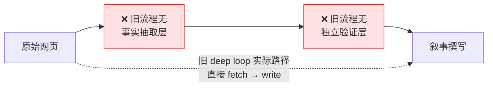
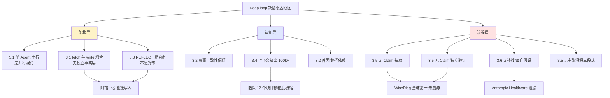
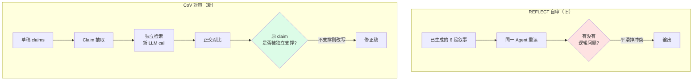
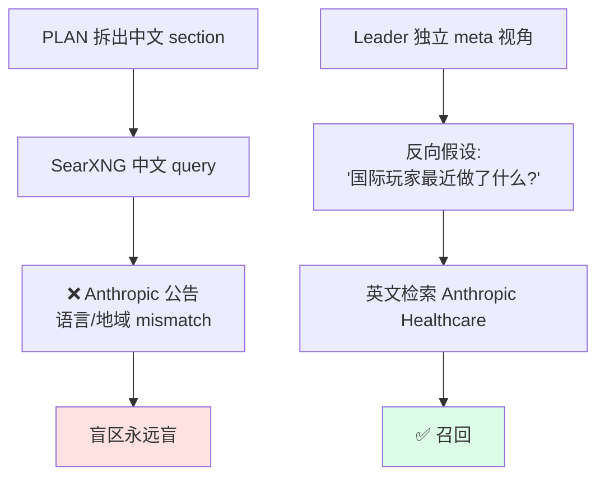

# Deep Loop Verification Pattern · CoV 验证模式

> **来源**: 2026-05-28 好伴AI 案例 RCA — 同一输入下，web-research-router deep loop（路径 A）与 Claude Code strategic-insight-longform Deep（路径 B）产出了 5 处事实级偏差。本文档把 RCA 的 6 维度根因 + CoV 实现 + 质量评分卡 + 5 案例实录沉淀为 deep loop Step 3 的实施手册。
>
> **配套**: `./deep-research-loop.md` v3.4 已把 CoV 写进 Step 3。本文是 CoV 的**实现细节**与**回归测试集**——deep loop 改造时对照本文 5 案例做自检。

## 0. 一图看懂：为什么需要 CoV



> **一句话**: deep loop 旧流程把 fetch、抽取、验证、叙事压成一次 LLM call，营销话术一旦叙事化就难以推翻。CoV 用独立检索 + 正交比对把"叙事一致性"翻回"事实正交性"。

## 1. 问题：REFLECT 为什么不够

deep loop 的 REFLECT 阶段是"同一 Agent 在相同上下文中的自我审视"——本质上是**在同一个先验下做 sanity check**。它只能发现"段落间的逻辑矛盾"，无法发现"整个上下文 based on 一个错误前提"。

**案例锚点**：REFLECT 没有质疑"蚂蚁阿福 1 亿用户 vs 好伴 1000 万 = 10x 差距"，因为整个上下文里"1亿"已经是叙事化的陈述，不是一张待验证的事实卡片。

## 2. 六维度根因分解（RCA 摘要）

> 五个偏差不是随机噪声，它们指向 deep loop 在 **架构 / 认知 / 流程** 三层的系统性问题。



### 3.1 架构 — fetch 与 write 耦合（80% 偏差的根因）

> 表面错误显示在 MERGE，root cause 在 SECTION。

- SECTION 阶段 `fetch + write` 一气呵成，**没有"事实卡片化"中间层**。
- 营销话术一旦写进散文，REFLECT 看到的是已叙事化文本，无法回到数据层推翻。
- **修复**：deep-research-loop.md v3.4 **Step 2.3** 强制 `facts.jsonl`，write_section 只能引 fact_id。

**证据**：蚂蚁 PR "用户突破1亿" → SECTION Agent 直接写成"竞争压力巨大"——它没把"1亿"先变成事实卡片（指标:用户数; 口径:未指明; 来源:PR稿; 可信度:单源），所以 REFLECT 看到的是叙事化的陈述。

### 3.2 认知 — 单 Agent 串行的 4 个固有偏差

| 偏差 | 机制 | 案例体现 |
|------|------|--------|
| **叙事一致性偏好** | LLM next-token 预测会平滑冲突信号，编织连贯故事 | 阿福 1亿 vs 好伴 1000万 = "10x 差距"，"1亿是累计 vs MAU?"的疑点被消化掉 |
| **首因效应** | 最早 fetch 到的页面成为隐性 anchor | WiseDiag PR 搜索靠前 → 后续 benchmark 讨论都围绕它 |
| **上下文挤出** | 6 段串行 → 前段证据被压缩为 summary → 无法回头核对 | 写到"竞争压力"section 时，无法核对阿福用户数的原始来源 |
| **路径依赖** | PLAN 拆 6 section → Agent 只在框架内搜索 → 框架外事实被结构性遗漏 | Claude for Healthcare 不在国内市场/政策/竞争对手的框架里，召不回来 |

> **关键判断**：这是**架构性**的（线性叙事生成 vs 正交事实建构），不是 prompt 能修的。
> **修复**：facts.jsonl 把口径独立物化（缓解偏好+首因+挤出）；多 Worker 并行（缓解路径依赖，P1）。

### 3.3 验证 — REFLECT vs CoV 的本质差距



**证据**：REFLECT 没抓"1亿"——它的上下文里只有已叙事化的"阿福 1 亿用户"，没有动机去拆回原子事实再质疑。CoV 强制独立 search "蚂蚁阿福 MAU 2026" → 命中 3000 万 → 推翻原 claim。

### 3.4 信息过载 — 6 section × 多源 fetch 的认知带宽超限

- 每 section ~5-8 URL × ~2-4k tokens = 6 × 6 × 3k ≈ **100k+ tokens 原始证据**
- LLM 启动 摘要-压缩 机制，把每 URL 压成 1-2 句存 working memory
- **口径细节系统性丢失**（MAU vs 累计、benchmark 版本号、政策项目名）

| 维度 | 单 Agent 串行 | 多 Worker 并行 (P1) |
|------|-------------|-------------------|
| 每个维度的认知投入 | 1/6 | 1/1（每 Worker 专注） |
| 原始证据保留率 | 低（必须压缩） | 高（专注一维） |
| 口径细节保留 | 系统性丢失 | 可以保留 |

> **关键判断**：换 Sonnet → Opus 也无法解决——这是**上下文经济学**问题。
> **修复**：facts.jsonl 把口径物化为外部状态（不再依赖上下文记忆）；P1 拆 2-3 Worker 并行。

### 3.5 流程 — Benchmark 选择性采信（流程缺陷 > prompt 缺陷）

- **表层**：prompt 没枚举"全球第一/行业领先/首家"等需警惕话术（但 prompt 不可能枚举完）。
- **深层**：deep loop **没有"主张 → 主张溯源 → 主张验证"三段式流程**。流程是"页面 → 直接写"，营销话术只要在页面里出现就有概率被原样搬出。

> **对照 CC 路径 B**: Leader 在 Worker 输出"WiseDiag 全球第一"后，**独立**发起 search "HealthBench leaderboard medical LLM 2025" → 命中百川 M3 65.1 > GPT-5.2 → 修正为"DoctorBench 上领先，HealthBench 上百川 M3 才是头部"。
>
> **关键不是 prompt 写得好，而是有"独立验证回路"这个流程动作**。

**修复**：deep-research-loop.md v3.4 **Step 3** 强制 CoV 三步 + **Step 5** 颗粒度 Gate 强制列对手 ≥ 2。

### 3.6 召回 — 跨地域 / 跨语言盲区



- 搜索词锚定中文语境 → 英文公告召不回
- 无"补搜"回路：一次 SearXNG 广扫之后直接进 SECTION，盲区永远是盲区
- 无"反向假设"：没有 meta 视角问"如果有重要的国际玩家，他们最近做了什么"

> **修复**：deep-research-loop.md v3.4 **Step 1** 强制产 meta_hypotheses + **Step 4.2** 盲区检视 + **Step 4.3** 反向假设搜索（强制跨语言 ≥ 1 次 + 反向 framing ≥ 1 次 + 对手视角 ≥ 1 次）。

## 3. CoV 三步实施（Step 3 的细节手册）

```
Claim 抽取 → 独立检索 → 正交比对
```

### Step 1: Claim Extraction（声明抽取）

从已生成的 section 草稿中扫描包含以下关键词的句子：

- `第一` / `最` / `独家` / `突破` / `领先` / `超过` / `首家` / `首个` / `全球` / `行业`
- 任何带数字的规模声明（用户数、金额、增长率、benchmark 分数）
- 任何政策引用（法规名、生效日期、覆盖范围）
- 任何 benchmark/排名结论（榜单名、排名位置）

产出 `claims_to_verify = [{text, type, source_fact_id, confidence}]`，按 `confidence=低/单源` 优先排序，受 `cov_max_claims_per_section`（默认 5，上限 10）限制。

### Step 2: Independent Search（独立检索）

对每个 claim 发起**独立**的 web search——**不复用之前的 fetch 结果**，**不与之前的上下文共享**。关键原则：

- **新 LLM call**: 单独起 call，prompt 里只含本 claim + 检索任务，不含 SECTION 的其它上下文
- **跨语言**: 中文 claim 也要搜英文（e.g. "WiseDiag benchmark ranking independent"）
- **跨信源**: PR 稿/官网 claim → 搜第三方报道、benchmark 原始榜单、竞争对手 PR
- **跨时间**: 搜更新的版本（e.g. HealthBench 2025/2026）

### Step 3: Orthogonal Comparison（正交比对）

新检索结果 vs 原 claim：

| 比对结果 | 行动 | facts.jsonl 更新 |
|---------|------|----------------|
| 独立信源支撑 | 标注 `verified[source]` | `verify_status: verified` + `verify_sources: [...]` |
| 无独立信源 | 标注 `单源，置信度降级`，保留但降权 | `verify_status: single-source` |
| 有矛盾信号 | 用新证据修正 claim，原文附加 `[已修正：原 X，新证据 Y]` | `verify_status: contradicted` + `corrected_value: ...` |
| 完全推翻 | 删除原 claim，替换为新证据结论 | `verify_status: refuted` |

## 4. 实现：最小可行动作（不大改架构）

如果不做 full CoV 改造，至少可以做以下最小改动：

```python
# 在 MERGE 之前插入
# 不用改 PLAN/SECTION/REFLECT，只在 MERGE 前加一个验证 pass

def verify_before_merge(all_sections, max_claims=5):
    """扫描所有 section 找出可验证 claim，独立搜索验证"""
    claims = []
    for section in all_sections:
        for line in section.content.split('\n'):
            if re.search(r'第一|最|独家|突破|领先|超过|首家|首个|[\d,]+万.*用户|[\d,]+亿.*用户', line):
                claims.append(extract_claim(line))

    # 对置信度最低的 max_claims 个 claim 做独立验证（新 LLM call，新 search）
    claims.sort(key=lambda c: c.confidence_score)
    for claim in claims[:max_claims]:
        result = independent_search(claim.text, new_context=True, cross_lang=True)
        if result.contradicts(claim):
            mark_for_correction(claim, result)
        elif result.no_independent_source(claim):
            downgrade(claim, tag="单源未独立验证")
```

完整版（v3.4 集成）见 `./deep-research-loop.md` Step 3。

## 5. REFLECT vs CoV 速查

| | REFLECT | CoV |
|---|---|---|
| 执行者 | 同一 Agent | 可不同 Agent / 独立 call |
| 上下文 | 复用 SECTION 的 fetch 结果 | 独立发起新 search |
| 发现什么 | 段落间逻辑矛盾 | prior 本身的错误 |
| 典型案例 | "第 3 段说的增长率与第 5 段矛盾" | "整个讨论基于一个错误的用户数口径" |

**REFLECT 和 CoV 不互斥**——可以在 MERGE 前先 REFLECT 做一致性检查，再 CoV 做正交验证。但 **REFLECT 不能替代 CoV**。

## 6. 信源分级速查（Source Trust Tier）

| 等级 | 类型 | 可信度 | 示例 |
|:---:|------|:---:|------|
| A | 独立第三方评测机构原始报告 | 高 | IDC 报告、benchmark 官方榜单 |
| B | 权威媒体独立报道 | 中高 | 人民日报、新华网、证券时报 |
| C | 公司官网/PR 稿 | 中 | 智诊科技官网"全球第一" |
| D | 自媒体/博客/知乎 | 低 | 知乎实测文章 |
| E | 未经验证的口头声称 | 不可用 | "业界人士认为" |

**规则**：等级 C 及以下的声称不能作为独立证据，必须找到 A/B 级信源交叉验证。

## 7. 质量评分卡（Quality Scorecard）

> deep loop 输出完成后，按下表打分；< 70 必须返工。

| 维度 | 权重 | 评估 | 0 分 | 5 分 | 10 分 |
|------|:--:|------|------|------|-------|
| **事实解耦** | 20 | facts.jsonl 是否产出且 write_section 只引 fact_id | 没产 / 文中有引用外的事实 | 产出但部分散文未引 | 全文事实均映射到 fact_id |
| **口径标注** | 15 | 数字类 fact 是否都有 scope（累计/MAU/DAU） | 全部缺失 | 部分缺失 | 全部有 scope，不明者写⚠️ |
| **Claim 溯源** | 20 | "第一/最/突破"类 claim 是否独立 search 验证 | 0% | 50% | 100% 含跨信源 |
| **跨语言/反向假设** | 15 | Step 4.3 是否做了 ≥ 1 次跨语言 + ≥ 1 次反向 framing | 都没做 | 只做了一种 | 都做了且有结果 |
| **颗粒度** | 15 | 政策/排名类是否列原始项目名/对手/榜单 | 全部笼统 | 部分笼统 | 全部列细节 |
| **信源分级** | 10 | source_tier 是否标注；C 及以下是否有 A/B 级交叉 | 不标 | 标但无交叉 | 标且必交叉 |
| **citation 完整性** | 5 | inline citation 是否全部映回 source map | 缺失 > 20% | 缺失 5-20% | 100% 映回 |

**及格线**: 70 / 100。低于 70 → 回 Step 3 补 CoV / Step 5 补颗粒度。

## 8. 案例：好伴AI 5 claim 验证实录（v3.4 回归测试集）

> 改造 deep loop 时把这 5 个 case 当回归测试——每个新版本必须能阻止所有 5 个偏差。

| # | 原 claim | 信源等级 | 旧流程偏差 | v3.4 阻止机制 | 最终处理 |
|---|---------|:---:|----------|--------------|---------|
| 1 | "蚂蚁阿福 1 亿用户" | C（蚂蚁 PR 稿） | 直接写入"1亿用户、竞争压力巨大" | **Step 2.3** scope 必须标注 → ⚠️未指明 + **Step 3** CoV 独立搜"蚂蚁阿福 MAU" → 命中 3000 万 → contradicted | "MAU 3000 万（2026.1）"，原 PR 1亿 标注为"累计/营销口径" |
| 2 | "WiseDiag 全球第一" | C（官网 PR） | 单源采信 | **Step 3** CoV 强制独立搜"HealthBench medical LLM 2025" → 命中百川 M3 65.1 > GPT-5.2 → contradicted + **Step 5** 必须列对手 ≥ 2 | "DoctorBench 上领先，HealthBench 百川 M3 65.1 > GPT-5.2" |
| 3 | "医保支持 AI 医疗" | B（政策文件） | 笼统"政策红利" | **Step 5** 颗粒度 Gate 政策类必须列 12 项目清单 → fail → 回 Step 3 补搜 → 修正 | "2026.4.1 医保纳入 12 个 AI 项目，全部为影像/筛查类（[项目1]…[项目12]），未覆盖全科咨询/数字分身" |
| 4 | "好伴 1000 万 vs 阿福 1亿 = 10x" | C（官网+PR） | 派生指标错误（口径不一致） | 修复 #1 后，f001 修正为 MAU 3000万、f002 仍为注册 1000万 → **Step 5** Gate 检测口径不一致 | "好伴 注册 1000 万 vs 阿福 MAU 3000 万（口径不可直接比；如同口径对比需追注册量）" |
| 5 | Anthropic Claude for Healthcare 完全遗漏 | — | 跨语言盲区，原报告完全遗漏 | **Step 1** meta_hypotheses 含"国际玩家最近动作" → **Step 4.2** 盲区检视命中 → **Step 4.3** 英文 query "Anthropic healthcare 2026" → 召回 | 补遗 section："Anthropic Claude for Healthcare 2026.X 发布" |

**回归测试通过条件**: 5 个 case 全部命中阻止机制，且最终处理与上表一致。

## 9. 与 v3.4 deep-research-loop.md 的关系映射

| 本文 | deep-research-loop.md v3.4 |
|------|----------------------------|
| 第 2 节 6 维度根因 | 顶部"核心思想转变"与 Step 2/3/4/5 总论 |
| 第 3 节 CoV 三步 | Step 3.1 / 3.2 / 3.3 |
| 第 4 节 最小可行 | Step 3 的简化实现版本 |
| 第 5 节 REFLECT vs CoV | Step 3 末尾对照表 |
| 第 6 节 信源分级 | Step 2.3 `source_tier` 字段值域 |
| 第 7 节 质量评分卡 | Step 5 颗粒度 Gate 之后的整体质量度量（v3.4 新增建议） |
| 第 8 节 5 案例实录 | Step 5 之后"对照 5 偏差案例的自检"表 |

## 10. 元反思（来自 RCA 第 7 节）

> 本验证模式的"实际数据"来自路径 B（CC strategic-insight-longform Deep）的输出，**未独立验证路径 B 是否也有偏差**。
> 严格的 RCA 应有第三方 ground truth（公司财报、benchmark 原始论文）。
>
> 建议：下次诊断 deep loop 时，准备一份**人工 verified 的事实清单**作为标尺，而不是用另一个 Agent 输出当标尺。

---

*Alex Cai · 2026-05-28 · 来自好伴AI深度研究案例 RCA，v3.4 集成版*
