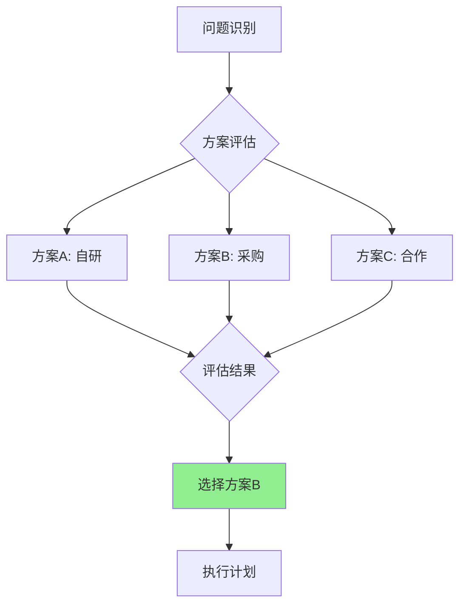

# 决策框架参考文档

本文档提供DACI和SPADE决策框架的使用指南和模板，供Agent和最终输出使用。**v3.0 新增**

---

## 1. DACI框架

### 1.1 框架概述

DACI是一种决策责任分配框架，用于明确决策过程中各方的角色和责任。

| 角色 | 英文 | 定义 | 职责 |
|-----|------|------|------|
| **D** | Driver | 推动者 | 推动决策进程，确保决策按时完成 |
| **A** | Approver | 批准者 | 最终决策权，可否决 |
| **C** | Contributors | 贡献者 | 提供意见和建议 |
| **I** | Informed | 知情者 | 需要了解决策结果 |

### 1.2 DACI模板

#### Markdown格式

```markdown
### 决策：[决策标题]

**DACI角色分配**

| 角色 | 人员 | 职责说明 |
|-----|------|---------|
| **D** 推动者 | [[张三]] | 负责推动讨论、收集意见、形成方案 |
| **A** 批准者 | [[李总]] | 最终决策权 |
| **C** 贡献者 | [[王五]]、[[赵六]] | 提供技术评估、市场分析 |
| **I** 知情者 | 研发团队、客户成功团队 | 决策后需要同步 |
```

#### Obsidian Callout格式

```markdown
> [!info]- DACI角色
> | 角色 | 人员 | 说明 |
> |-----|------|-----|
> | 🚗 Driver | [[张三]] | 推动决策 |
> | ✅ Approver | [[李总]] | 最终批准 |
> | 💡 Contributors | [[王五]]、[[赵六]] | 贡献意见 |
> | 📢 Informed | 研发团队 | 需知情 |
```

### 1.3 DACI使用指南

#### 何时使用DACI

- 跨团队决策
- 影响多方利益的决策
- 需要明确责任的重要决策
- 历史上有责任不清导致问题的领域

#### DACI最佳实践

1. **Driver数量**：通常只有1个Driver
2. **Approver数量**：1-2个，避免过多导致决策瘫痪
3. **Contributors范围**：邀请必要的专家，避免过多
4. **Informed及时性**：决策后48小时内同步

#### 常见问题

| 问题 | 解决方案 |
|-----|---------|
| 没有明确的Approver | 升级到上级确认决策权归属 |
| Contributors太多 | 分层：核心Contributors + 可选咨询 |
| Driver没有推动力 | 设置决策截止日期和检查点 |
| Informed未及时通知 | 建立标准通知流程 |

---

## 2. SPADE框架

### 2.1 框架概述

SPADE是一种决策文档化框架，帮助完整记录决策的背景、过程和结果。

| 要素 | 英文 | 定义 | 核心问题 |
|-----|------|------|---------|
| **S** | Setting | 背景 | 为什么现在需要这个决策？ |
| **P** | People | 人员 | 谁参与了决策？各自角色是什么？ |
| **A** | Alternatives | 备选方案 | 考虑了哪些选项？ |
| **D** | Decide | 决定 | 最终选择了什么？为什么？ |
| **E** | Explain | 解释 | 这意味着什么？有什么影响？ |

### 2.2 SPADE模板

#### 完整Markdown格式

```markdown
## 决策记录：[决策标题]

### Setting（背景）

**决策背景**：[描述为什么需要做这个决策]

**紧迫性**：🔴 紧急 / 🟡 重要 / 🟢 常规

**约束条件**：
- [约束1]
- [约束2]

### People（人员）

[DACI表格]

### Alternatives（备选方案）

#### 方案A：[方案名称]

**描述**：[方案描述]

| 优点 | 缺点 |
|-----|-----|
| [优点1] | [缺点1] |
| [优点2] | [缺点2] |

**结论**：❌ 未采纳
**原因**：[为什么没有选择这个方案]

#### 方案B：[方案名称] ✅ 采纳

**描述**：[方案描述]

| 优点 | 缺点 |
|-----|-----|
| [优点1] | [缺点1] |
| [优点2] | [缺点2] |

### Decide（决定）

**最终决策**：[清晰陈述最终决定]

**选择理由**：
1. [理由1]
2. [理由2]

**决策依据**：
- [依据的数据/信息1]
- [依据的数据/信息2]

### Explain（解释）

**这意味着什么**：
- 对[A方面]的影响：[描述]
- 对[B方面]的影响：[描述]

**预期结果**：
- [预期结果1]
- [预期结果2]

**风险与缓解**：
| 风险 | 缓解措施 |
|-----|---------|
| [风险1] | [措施1] |

**复审日期**：[YYYY-MM-DD]
```

#### Obsidian Callout格式

```markdown
> [!question]- SPADE决策框架
>
> **Setting（背景）**
> [决策背景描述]
>
> **People（人员）**
> - Driver: [[张三]]
> - Approver: [[李总]]
>
> **Alternatives（备选方案）**
> - 方案A：[描述] - ❌ 未采纳（原因）
> - 方案B：[描述] - ✅ 采纳
>
> **Decide（决定）**
> [最终决策内容]
>
> **Explain（解释）**
> [决策影响和意义]
```

### 2.3 SPADE使用指南

#### 何时使用完整SPADE

- 战略性决策
- 有多个备选方案的决策
- 需要事后回溯的决策
- 可能被质疑的决策

#### 何时使用简化SPADE

- 常规决策：只记录D（决定）和E（解释）
- 紧急决策：先决定，后补文档

#### SPADE最佳实践

1. **Setting要具体**：不只是"我们需要决定X"，而是"因为Y原因，我们必须在Z时间前决定X"
2. **Alternatives要诚实**：记录真正考虑过的方案，包括"什么都不做"
3. **Decide要清晰**：用一句话能说明白决定了什么
4. **Explain要考虑读者**：不同读者关心不同影响

---

## 3. 权衡分析矩阵

### 3.1 模板

```markdown
### 权衡分析

| 评估维度 | 权重 | 方案A | 方案B | 方案C |
|---------|-----|------|------|------|
| [维度1] | 30% | ⭐⭐⭐⭐ | ⭐⭐⭐ | ⭐⭐ |
| [维度2] | 25% | ⭐⭐⭐ | ⭐⭐⭐⭐ | ⭐⭐⭐ |
| [维度3] | 25% | ⭐⭐ | ⭐⭐⭐ | ⭐⭐⭐⭐ |
| [维度4] | 20% | ⭐⭐⭐⭐ | ⭐⭐ | ⭐⭐⭐ |
| **加权总分** | | **3.4** | **3.1** | **3.0** |

**评分说明**：
- ⭐⭐⭐⭐⭐ (5分)：明显优势
- ⭐⭐⭐⭐ (4分)：较好
- ⭐⭐⭐ (3分)：中性
- ⭐⭐ (2分)：较差
- ⭐ (1分)：明显劣势

**核心权衡**：
- 选择方案A，意味着[获得X]但[放弃Y]
- [其他权衡点]

**缓解措施**：
- 针对[方案A的缺点1]：[缓解措施]
```

### 3.2 常用评估维度

| 决策类型 | 推荐评估维度 |
|---------|-------------|
| **产品决策** | 用户价值、开发成本、上市时间、技术风险、可维护性 |
| **技术决策** | 性能、成本、可扩展性、团队熟悉度、生态系统支持 |
| **商务决策** | 收益潜力、投入成本、风险、战略契合度、时间敏感性 |
| **资源决策** | ROI、风险、战略重要性、紧迫性、可替代性 |
| **人员决策** | 能力匹配、成长潜力、文化契合、可用性、成本 |

---

## 4. 复审机制

### 4.1 复审日期设置指南

| 决策类型 | 默认复审周期 | 触发条件 |
|---------|-------------|---------|
| 战略决策 | 季度 | 外部环境重大变化 |
| 产品决策 | 迭代/月度 | 用户反馈或数据异常 |
| 技术决策 | 实施后1个月 | 性能或稳定性问题 |
| 资源决策 | 下个预算周期 | 资源使用率异常 |
| 临时决策 | 2周 | 问题解决或升级 |

### 4.2 复审清单

```markdown
> [!warning] 复审提醒
> 此决策计划在 **{{date}}** 复审
>
> **复审清单**：
> - [ ] 决策背景是否仍然成立？
> - [ ] 预期结果是否达成？
> - [ ] 是否有新的信息/变化？
> - [ ] 是否需要调整？
```

---

## 5. Obsidian集成示例

### 5.1 决策日志页面模板

```markdown
---
title: 决策日志 - {{date}}
tags: [decision-log, project/xxx]
decision_count: 3
---

# 决策日志

## 决策1: [标题]

> [!question]- SPADE框架
> **Setting**: [背景]
> **People**: Driver [[张三]], Approver [[李总]]
> **Alternatives**: 方案A（❌），方案B（✅）
> **Decide**: [决定]
> **Explain**: [解释]

### 权衡矩阵
| 维度 | 方案A | 方案B |
|-----|------|------|
| 成本 | ⭐⭐ | ⭐⭐⭐⭐ |

> [!warning] 复审日期
> 此决策应在 [[2024-03-01]] 前复审

---

## 决策2: [标题]

[...]
```

### 5.2 Mermaid决策流程图

```markdown

```

---

## 6. 快速参考卡片

### DACI速查

```
D = Driver（推动者）→ 谁负责推动？
A = Approver（批准者）→ 谁有最终决策权？
C = Contributors（贡献者）→ 谁提供意见？
I = Informed（知情者）→ 谁需要知道结果？
```

### SPADE速查

```
S = Setting（背景）→ 为什么要决策？
P = People（人员）→ 谁参与？
A = Alternatives（备选）→ 有哪些选项？
D = Decide（决定）→ 选了什么？
E = Explain（解释）→ 意味着什么？
```

### 权衡分析速查

```
1. 确定评估维度（3-5个）
2. 分配权重（总和100%）
3. 对每个方案打分（1-5分）
4. 计算加权总分
5. 记录核心权衡点
```
