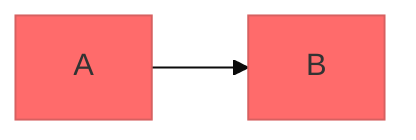
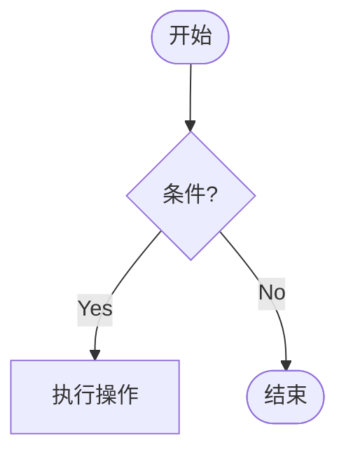
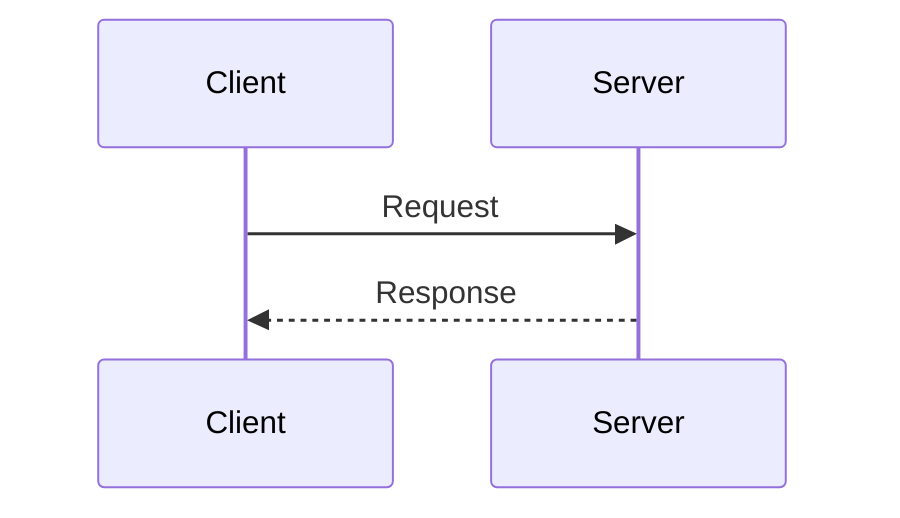
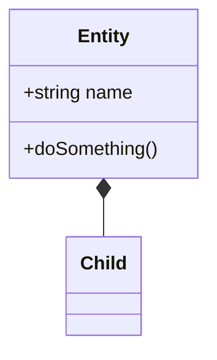
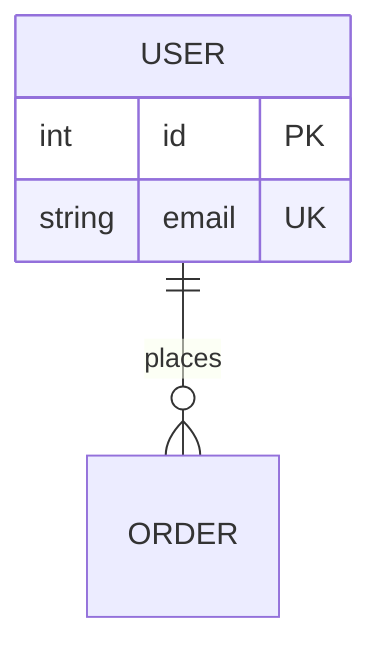
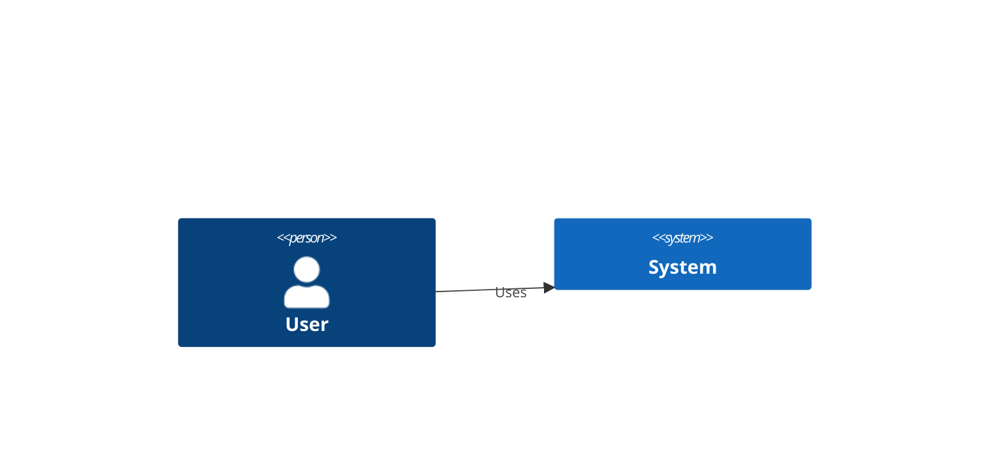
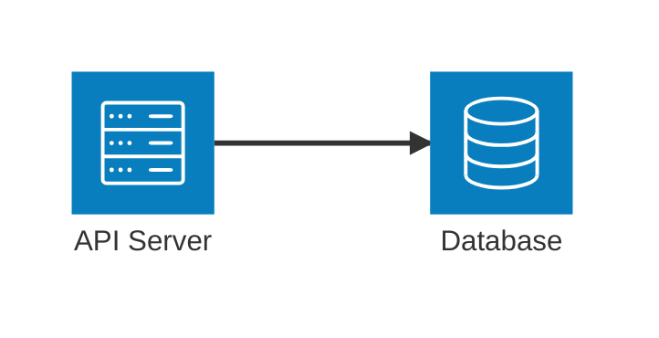
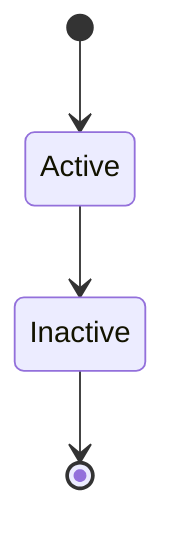

# Obsidian Markdown AC

> Obsidian 1.11.7+ · Mermaid v11 · 仅 dagre 布局

## 🚨 Red Flags: DO NOT SKIP THIS SKILL

| Excuse | Reality |
|--------|---------|
| "标准 Markdown 够了，不需要 Obsidian 语法" | Wikilinks/embeds/callouts 是 Obsidian 核心，忽略 = 笔记不可用 |
| "Mermaid 语法记住了，不用加载 reference" | 具体图表类型语法易记错，必须按需加载 reference |
| "我直接画就行，不用走决策树" | 用错图表类型返工成本高 |
| "美化规则太啰嗦，跳过" | 用户没说明确"简洁"时默认全面美化，这是核心价值
| "我要保存到 vault，所以只加载这个 skill" | 本 skill 只管内容格式；vault 路径、写入、同步要配合 `obsidian` |

## 边界决策

| 用户需求 | 使用 |
|---|---|
| 写出好看的 Obsidian 笔记内容、Callout、wikilinks、frontmatter | `obsidian-md-ac` |
| Mermaid / Canvas / schema / 架构图 / 流程图 | `obsidian-md-ac` |
| 找 vault、读写文件、同步、Obsidian CLI、Bases、Defuddle、qmd | `obsidian` |
| 把美化后的笔记保存进 vault | 两者联用：本 skill 定内容，`obsidian` 执行 IO |

## 默认行为：全面美化

**当用户请求生成、改写或美化 Obsidian 笔记内容且没有明确指定格式要求时，默认执行以下全部美化：**

### 结构美化
- 合理使用标题层级（`#` ~ `####`），确保结构清晰
- 段落之间保留空行，避免文字堆砌
- 长内容用分隔线 `---` 划分章节
- 列表项保持一致缩进

### 格式美化
- 关键信息用 **加粗**、重要术语用 *斜体*、亮点用 ==高亮==
- 适当使用 callouts（`> [!tip]`、`> [!info]`、`> [!warning]` 等）突出要点
- 表格对齐、代码块标注语言
- 任务列表用 `- [ ]` / `- [x]`

### Emoji 美化
- **标题**：每个标题前加 1 个合适的 emoji（如 `## 🔧 配置`、`## 📊 数据分析`）
- **列表项**：仅在关键概念前加 emoji（如 `- 📌 重点`），不在每项前加
- **正文**：偶尔点缀，代码块和表格中不加
- **Callout 标题**：加 emoji 以强调类型（如 `> [!tip] 💡 提示`）

### 内容美化
- Frontmatter 属性完整 — 遵循五维元数据模型（详见 `references/methodology-rules.md`）
- 内链用 `[[wikilinks]]` — 三阶段构建：扫描过滤 → 嵌入分离 → 概念深链（详见 `references/methodology-rules.md`）
- 标签用四维分面体系 — `type/`、`status/`、`src/`、`topic/`（极度慎用）
- 页尾附加链接关系分析 — 使用关系符号（`→` `⊕` `⊗` `↗` `≡` `⇄`）
- 适当使用脚注 `[^1]` 标注来源

### Callout 选型判断
- **NOTE** — 一般补充信息，不看也不影响理解
- **TIP** — 实用建议，能帮读者更高效
- **IMPORTANT** — 必须了解，跳过会导致误解
- **WARNING** — 潜在风险，不注意会出问题
- **DANGER** — 严禁事项，违反会造成损失
- **ABSTRACT** — 章节概要，用在章节开头（通常折叠 `> [!abstract]-`）
- **QUOTE** — 引用原文，非自己的话

> **退出条件**：如果用户明确说"不要 emoji"、"简洁"、"clean"、"minimal"，或要求特定专业风格（如"学术"、"法律"），则跳过对应的美化步骤。

---

## 按需加载协议

**最重要的规则 — 不要依赖训练数据，先加载参考文件。**

1. 从下方查找表中识别用户需求
2. 用 `read_file` 工具加载对应的参考文件
3. 严格遵循参考文件中的语法，而非内置知识
4. 多种需求时，加载多个参考文件
5. 无专用参考文件的图表类型（State, Gantt, Pie, Git Graph），参考本文档的速查示例，高级配置见 `references/mermaid-advanced.md`

## 参考文件查找表

| 需求 | 参考文件 |
|------|---------|
| Obsidian 语法 (wikilinks, embeds, callouts, properties, tags, math, footnotes, comments) | `references/obsidian-syntax.md` |
| Flowchart (`flowchart TD/LR`) | `references/mermaid-flowcharts.md` |
| Sequence Diagram (`sequenceDiagram`) | `references/mermaid-sequence.md` |
| Class Diagram (`classDiagram`) | `references/mermaid-class.md` |
| ERD (`erDiagram`) | `references/mermaid-erd.md` |
| C4 Diagram (`C4Context/C4Container/C4Component`) | `references/mermaid-c4.md` |
| Architecture Diagram (`architecture-beta`) | `references/mermaid-architecture.md` |
| Mermaid 主题 / 样式 / 配置 | `references/mermaid-advanced.md` |
| State / Gantt / Pie / Git Graph | 见本文档速查示例 + `references/mermaid-advanced.md` |
| YAML / 标签 / 双链 / Callout 判断规则 / 密度控制 / 内容保护 | `references/methodology-rules.md` |

---

## Mermaid 关键规则（全类型通用）

以下规则适用于**所有** Mermaid 图表类型，务必牢记：

- 使用 ` ```mermaid ` 代码块 — Obsidian 原生渲染，无需插件
- 换行用 `<br>` — **绝对不要用 `\n`**（在 Obsidian 中显示为字面文本）
- 注释用 `%%`（不是 `//` 或 `#`）
- 未知关键词会**静默破坏**图表 — 不显示任何错误
- 配置统一使用 **YAML frontmatter**，不要用旧版 `%%{init}%%` 语法
- 主题：`default` | `forest` | `dark` | `neutral` | `base`
- 布局：**仅 `dagre`**（Obsidian 不支持 ELK 布局引擎）
- 外观：`classic`（默认）| `handDrawn`（手绘风格）

### 配置示例

````markdown

````

> 更多主题、色彩、样式配置选项，见 `references/mermaid-advanced.md`。

## Mermaid 常见陷阱

- `{}` 在注释中会破坏解析器 — 即使在 `%%` 注释中也要避免
- 拼写错误导致图表**静默失败** — 没有任何报错
- ELK 布局在 Obsidian 中**不可用** — 只能用 dagre
- Architecture 图只有 5 个默认图标（`cloud`, `database`, `disk`, `internet`, `server`）
- 过度复杂的图 → 拆成多个小图
- 特殊字符的标签 → 用 `""` 引号包裹
- 增量开发 → 每加几个节点就预览一次

## Best Practices

详见 `references/mermaid-advanced.md`。

---

## Mermaid 图表选型决策

**用户说"画个图"时，先判断用什么类型：**

| 用户需求 | 推荐图表 | 判断依据 |
|:---------|:---------|:---------|
| 流程、步骤、决策分支、工作流 | **Flowchart** | 有"先做什么再做什么"的逻辑 |
| 系统交互、API 调用、消息传递 | **Sequence** | 多方之间有时间顺序的交互 |
| 领域模型、OOP 设计、类关系 | **Class** | 关注属性、方法、继承/组合 |
| 数据库表结构、字段关系 | **ERD** | 有主键外键、一对多关系 |
| 软件架构、系统边界 | **C4** | 关注人员→系统→容器→组件层级 |
| 云服务、基础设施拓扑 | **Architecture** | 服务器、数据库、网络连接 |
| 状态变化、生命周期 | **State** | 对象在不同状态间转换 |
| 项目时间线、里程碑 | **Gantt** | 有开始/结束时间的任务 |
| 比例分布、占比 | **Pie** | 各部分占总体的百分比 |
| Git 分支策略 | **Git Graph** | 展示分支和合并流程 |

> 复杂场景可组合多个图：先用 C4 画全局架构，再用 Sequence 画关键交互，最后用 ERD 画数据模型。

---

## 图表类型速查

### Flowchart — 流程、决策、工作流
````markdown

````

### Sequence — 时序交互、API 调用
````markdown

````

### Class — 领域模型、OOP 设计
````markdown

````

### ERD — 数据库 Schema
````markdown

````

### C4 — 软件架构（上下文/容器/组件）
````markdown

````

### Architecture — 云服务、基础设施
````markdown

````

### State — 状态机、生命周期
````markdown

````

### 其他支持的类型
- **Git Graph** — 分支策略 (`gitGraph`)
- **Gantt** — 项目时间线 (`gantt`)
- **Pie Chart** — 数据分布 (`pie`)

---

## Obsidian 集成技巧

- **图中内链**：用 `class A,B internal-link;` 让节点可点击跳转 Obsidian 笔记
- **CSS 主题**：通过 `.obsidian/snippets/` 覆盖 Mermaid 颜色
- **大图拆分**：拆成多个小图，配合描述性标题
- **嵌入图表**：创建只含图表的笔记，然后用 `![[DiagramNote]]` 嵌入

## JSON Canvas（.canvas 画布）

创建 Obsidian Canvas 文件——节点（text/file/link/group）、边（箭头+标签）、分组、颜色。基于 [JSON Canvas Spec 1.0](https://jsoncanvas.org/spec/1.0/)。

### ① 4 步工作流

1. **create** — 新建 `.canvas`，基础结构 `{"nodes": [], "edges": []}`；每个 node/edge 生成唯一 16 字符小写 hex ID（如 `"6f0ad84f44ce9c17"`）
2. **add node** — 追加节点到 `nodes`，必填 `id`/`type`/`x`/`y`/`width`/`height`
3. **connect** — 追加边到 `edges`，设 `fromNode`/`toNode` 引用已存在节点 ID
4. **edit / validate** — 读取并解析现有文件再改；落盘前过校验清单（见 ⑥）

### ② 4 种 node type 速查

| type | 必填属性 | 可选属性 |
|------|---------|---------|
| `text` | `text`（支持 Markdown）| `color` |
| `file` | `file`（vault 内路径）| `subpath`（`#标题`/`#^块`）、`color` |
| `link` | `url`（外部链接）| `color` |
| `group` | —（仅通用字段）| `label`、`background`、`backgroundStyle`（`cover`/`ratio`/`repeat`）、`color` |

```json
{ "id": "6f0ad84f44ce9c17", "type": "text", "x": 0, "y": 0,
  "width": 400, "height": 200, "text": "# 标题\n\n**Markdown** 正文" }
```

```json
{ "id": "d4e5f6789012345a", "type": "group", "x": -50, "y": -50,
  "width": 1000, "height": 600, "label": "Project Overview", "color": "4" }
```

> 🪤 JSON 换行用 `\n`，不用字面 `\\n`。坐标可为负（x 向右增、y 向下增，canvas 无限延伸）。

### ③ edge 属性速查

| 属性 | 必需 | 默认 | 取值 |
|------|:--:|------|------|
| `fromNode` | ✅ | - | 源节点 ID |
| `toNode` | ✅ | - | 目标节点 ID |
| `fromSide` / `toSide` | ❌ | - | `top` / `right` / `bottom` / `left` |
| `fromEnd` | ❌ | `none` | `none` / `arrow` |
| `toEnd` | ❌ | `arrow` | `none` / `arrow` |
| `color` | ❌ | - | 预设 `"1"`-`"6"` 或 hex |
| `label` | ❌ | - | 边上文字 |

```json
{ "id": "0123456789abcdef", "fromNode": "6f0ad84f44ce9c17", "fromSide": "right",
  "toNode": "a1b2c3d4e5f67890", "toSide": "left", "toEnd": "arrow", "label": "leads to" }
```

### ④ 6 色预设

| `"1"` | `"2"` | `"3"` | `"4"` | `"5"` | `"6"` |
|:--:|:--:|:--:|:--:|:--:|:--:|
| 红 | 橙 | 黄 | 绿 | 青 | 紫 |

预设值有意未定义——应用用各自品牌色渲染。也可直接写 hex（如 `"#FF0000"`）。node 与 edge 都支持 `color`。

### ⑤ 布局指南

- 节点间距 **50–100px**；分组内边距 **20–50px**；子节点放在 group 边界内
- 对齐网格（坐标取 **10 / 20 的倍数**）更整洁；`x` 向右增、`y` 向下增，坐标可为负
- `nodes` 数组顺序决定 z-index（第一个=底层，最后一个=顶层）

| 节点类型 | 推荐宽 | 推荐高 |
|---------|------|------|
| 小文本 | 200–300 | 80–150 |
| 中文本 | 300–450 | 150–300 |
| 大文本 | 400–600 | 300–500 |
| 文件预览 | 300–500 | 200–400 |
| 链接预览 | 250–400 | 100–200 |

### ⑥ 校验清单（落盘前必过）

- [ ] 所有 `id`（nodes + edges）唯一
- [ ] 每个 `fromNode` / `toNode` 引用的节点存在
- [ ] 各 type 必填字段完整（text→`text`、file→`file`、link→`url`）
- [ ] `type` ∈ `text` / `file` / `link` / `group`
- [ ] `fromSide` / `toSide` ∈ `top` / `right` / `bottom` / `left`
- [ ] `fromEnd` / `toEnd` ∈ `none` / `arrow`
- [ ] `color` 为 `"1"`-`"6"` 或合法 hex
- [ ] JSON 可解析

> 完整 schema、ID 生成、逐节点示例与字段细节：`references/json-canvas.md`

## 生态协作

本 skill 属于**内容展示层**，在 Skill 生态中的位置：

- **上游**：`voice-to-markdown-workflow`（产出转录文本）→ 本 skill（格式化为 Obsidian 笔记）
- **下游执行**：`obsidian`（vault 路径、文件写入、同步、Bases、CLI）、`pdf`（导出）
- **联动**：收到 voice-to-markdown 产出时，优先做结构美化和 Callout 标注

> [!important] 🤝 `obsidian-md-ac` ↔ `obsidian` 职责分工
> - **`obsidian-md-ac`（本 skill）= 内容/格式权威**：Obsidian 语法、Callout、wikilinks、frontmatter、Mermaid、JSON Canvas、美化决策。
> - **`obsidian` = vault 操作权威**：路径解析、文件 IO、同步、CLI、Bases（.base）、Defuddle、qmd 索引。
> - **联用顺序**：先用 `obsidian-md-ac` 定内容与格式 → 再用 `obsidian` 执行写入 / 同步 / 验证。

---

## Obsidian Markdown 基础

标准 Markdown（标题、加粗、斜体、列表、表格、引用、代码块）无需参考。需要 Obsidian 独有语法时，加载 `references/obsidian-syntax.md`，不要在主体里凭记忆补全。

---

## ✅ Verification Checklist (RUN BEFORE RETURNING RESULTS)

- [ ] 决策树跑过？图表类型选对（flowchart / sequence / class / ERD / C4 / architecture / state / gantt / pie）？
- [ ] 特定图表类型的 reference 加载了（不依赖训练数据）？
- [ ] 全面美化执行了（除非用户明确说"简洁"）？含 emoji、结构、格式、内容美化
- [ ] Mermaid 关键规则遵守：`\n`→`<br>`、注释用 `%%`、不用 ELK 布局？
- [ ] Canvas 创建时：JSON 验证通过 + 所有边引用存在 + ID 唯一？
- [ ] 如果要保存进 vault，是否交给 `obsidian` 处理路径、写入、同步和验证？

**Every box must honestly pass before returning results. If unchecked, go back.**
