> [!info] Obsidian Integration
> 在 Obsidian 中，直接使用 \`\`\`mermaid 代码块即可渲染图表，无需额外配置。本文档是 [obsidian-md-ac](../SKILL.md) skill 的子参考。

# Advanced Mermaid Features

Obsidian 中 Mermaid 图表的高级配置、样式、主题和专业技巧。

**本文档涵盖：** Frontmatter 配置、内置主题、自定义色彩、CSS 类样式、布局与外观选项。
**各图表类型特有的高级用法**（如 Sequence 的 alt/loop、Class 的接口继承）见对应的专用参考文件。

> [!warning] Obsidian 兼容性须知
> - **ELK 布局不可用** — Obsidian 的 Mermaid v11 不包含 ELK 布局引擎，只能用 `dagre`
> - **统一使用 frontmatter config** — 不要用旧版 `%%{init: {...}}%%` 语法，行为不一致
> - **HTML/React 集成不适用** — Obsidian 通过 ` ```mermaid ` 代码块渲染
> - **CLI 导出不适用** — `mmdc` 是独立工具，不在 Obsidian 内使用

## Frontmatter 配置（推荐方式）

在图表顶部添加 YAML 配置：

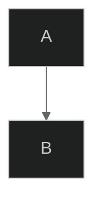

> [!warning] 不要使用旧版 init 语法
> 避免使用 `%%{init: {'theme':'forest'}}%%` 这种内联初始化语法。它是旧版 Mermaid 遗留语法，在 Obsidian 的 Mermaid v11 中行为可能不一致。**统一使用 YAML frontmatter config。**

## Themes

### Built-in Themes

| Theme | Description |
|-------|-------------|
| `default` | Standard blue theme |
| `forest` | Green earth tones |
| `dark` | Dark mode friendly |
| `neutral` | Grayscale professional |
| `base` | Minimal base theme for customization |

### Theme Examples

**Default Theme:**
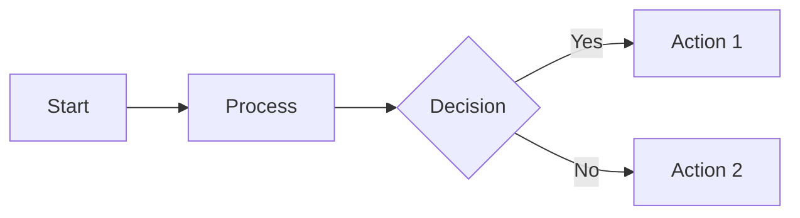

**Dark Theme:**
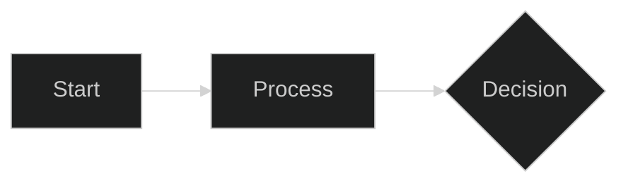

**Forest Theme:**
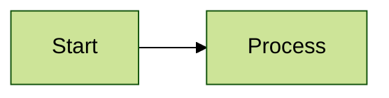

## Custom Theme Variables

覆盖特定颜色（从 `base` 主题开始以获得完全控制）：

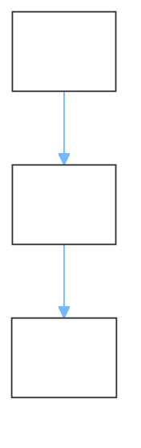

## Layout Options

Obsidian 仅支持 **dagre** 布局引擎：


> [!warning] ELK 布局不可用
> ELK 从 Mermaid v11.0 主包移除，需单独安装 `@mermaid-js/layout-elk`。Obsidian 未包含此包。
>
> **替代方案：**
> - 调整流向（`TD` vs `LR`）减少交叉线
> - 拆分为多个小图
> - 调整节点声明顺序（影响布局优先级）
> - 使用 subgraph 分组引导布局

## Look Options

### Classic Look

传统 Mermaid 外观：

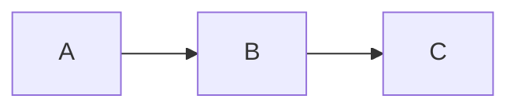

### Hand-Drawn Look

手绘草图风格：

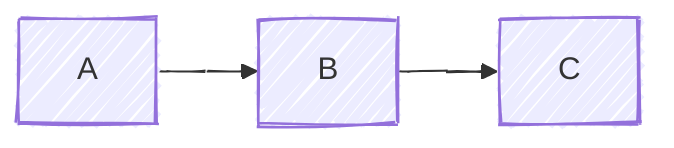

## Complete Configuration Example

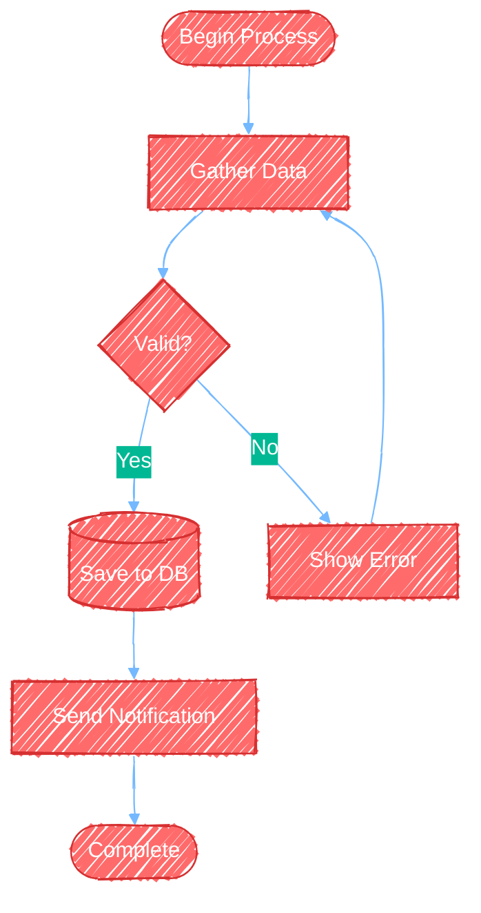

## Diagram-Specific Styling

### Flowchart Styling

**Class-based styling（推荐）：**
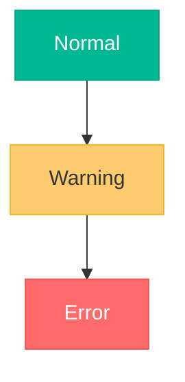

**Node-specific styling：**
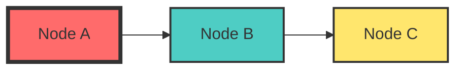

**Link styling：**
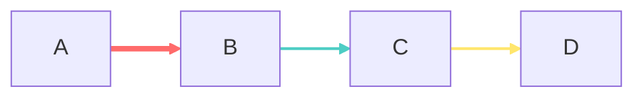

### Sequence Diagram Theming

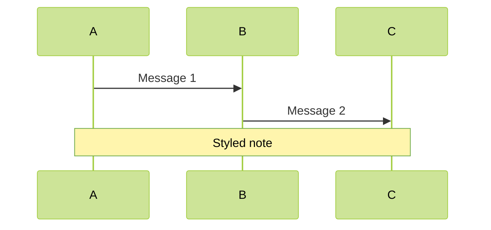

### Class Diagram Theming

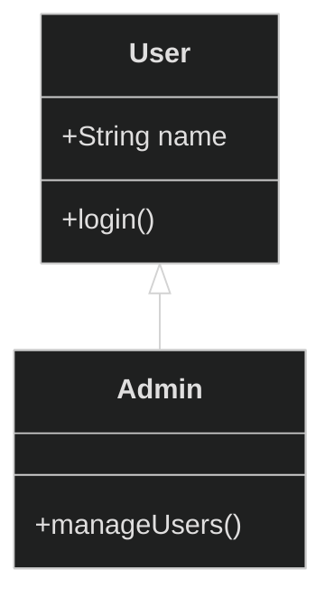

## Click Events and Links

添加交互元素（链接会在浏览器中打开）：

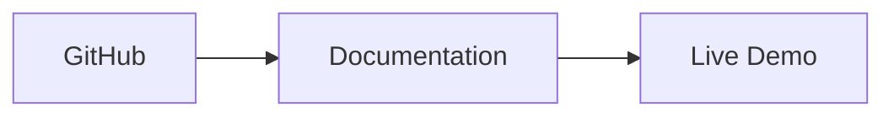

## Subgraph Styling

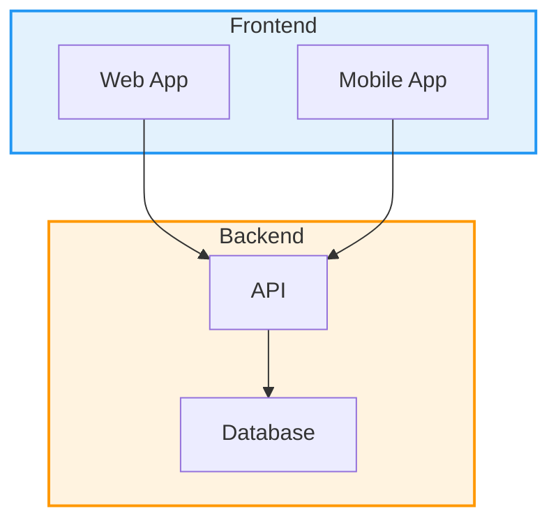

## Comments and Documentation

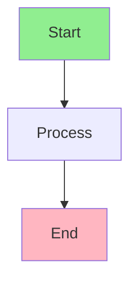

> [!caution] 注释中避免使用 `{}`
> Mermaid 解析器会将 `{}` 解释为语法结构，即使在 `%%` 注释中也可能破坏图表渲染。用自然语言代替。

## Complex Styling Example

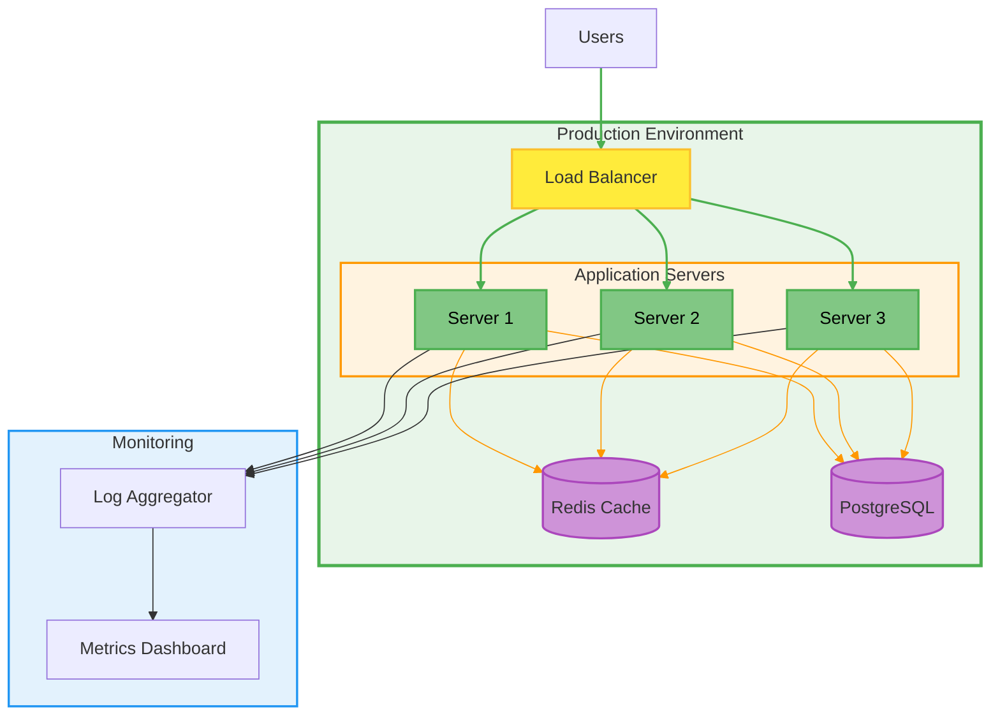

## Performance Tips for Large Diagrams

**在 Obsidian 中优化复杂图表（无 ELK 的替代方案）：**
- 用 `subgraph` 组织复杂性并引导布局
- 调整流向（`TD` vs `LR` vs `TB`）减少交叉线
- 超过 20 个节点的图拆成多个聚焦视图
- 样式集中在关键元素 — 颜色太多降低清晰度
- 用 `A & B & C --> D` 语法简化多连接

## Accessibility Considerations

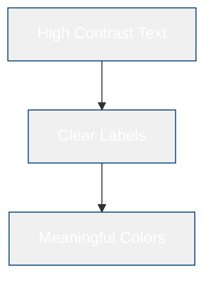

**Accessibility tips:**
- Use high contrast color combinations
- Don't rely solely on color to convey meaning
- Include descriptive text labels
- Test with color blindness simulators
- Consider dark mode alternatives (use `dark` theme or test with Obsidian's dark mode)

## Best Practices for Advanced Features

1. **Use themes consistently** — 同一笔记中相关图表使用同一主题
2. **Don't over-style** — 颜色太多降低清晰度
3. **Test hand-drawn look** — 某些场景 `handDrawn` 比 `classic` 更合适
4. **Use subgraphs for complex layouts** — 这是 Obsidian 中引导布局的主要方式
5. **Comment complex configurations** — 解释不直观的样式选择（但注释中避免 `{}`）
6. **Keep it accessible** — 足够的颜色对比度
7. **Use `base` theme for custom colors** — 其他主题会部分覆盖你的 themeVariables
8. **Prefer `classDef` over `style`** — 更可复用、更整洁
