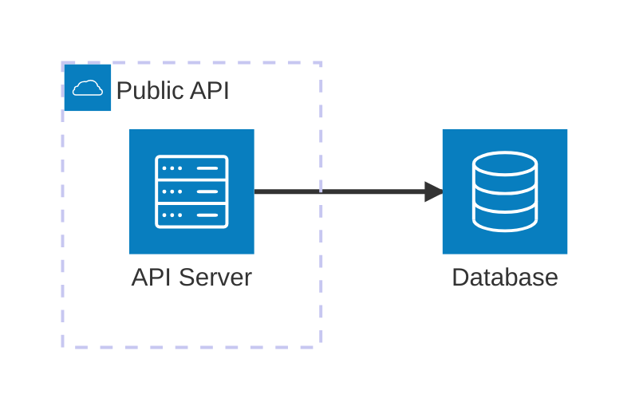
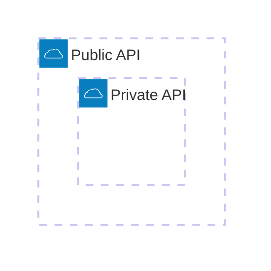
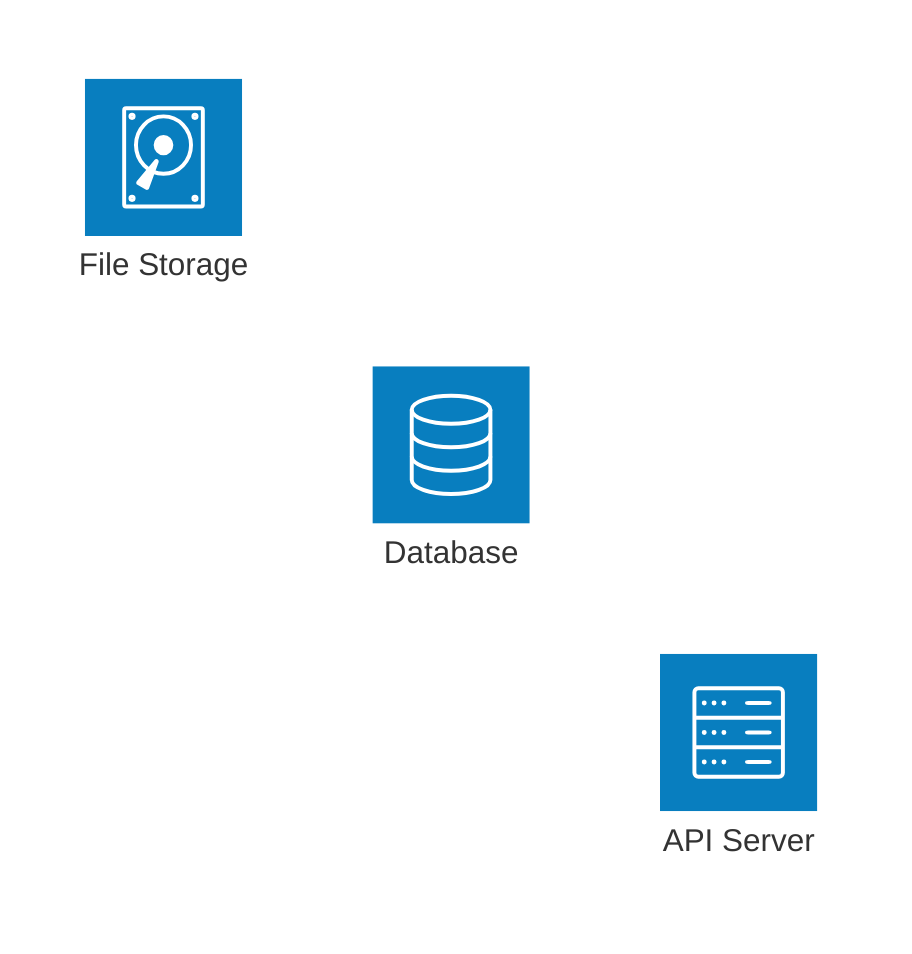
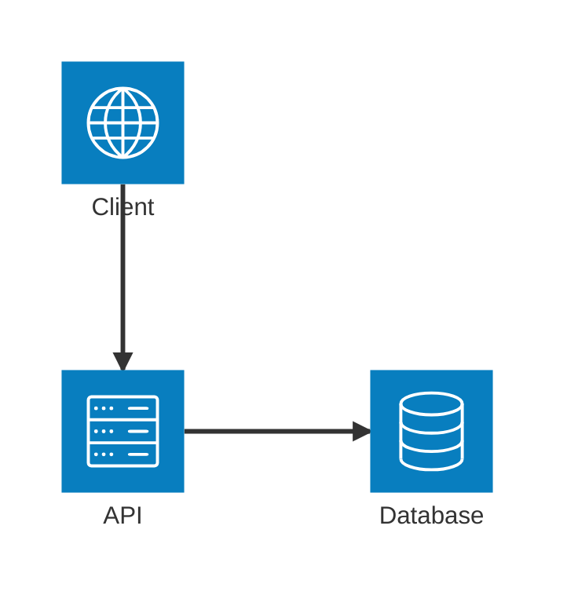
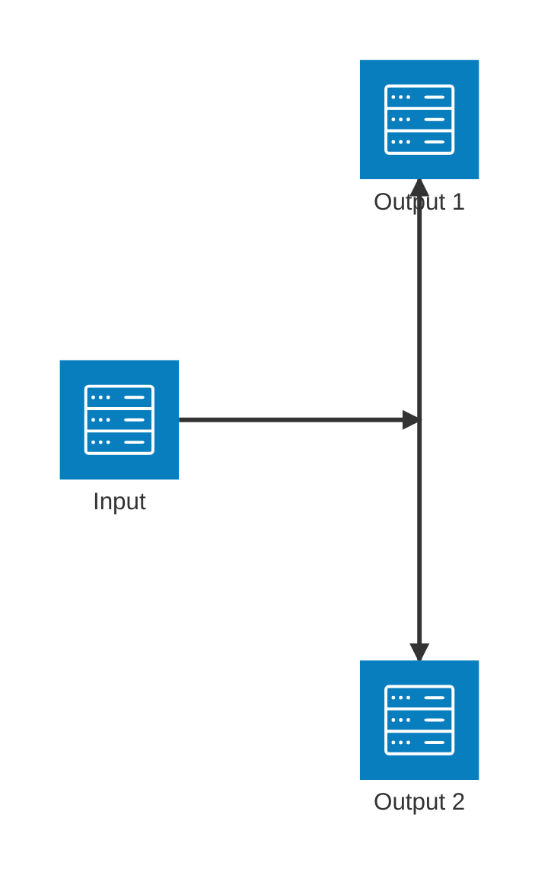
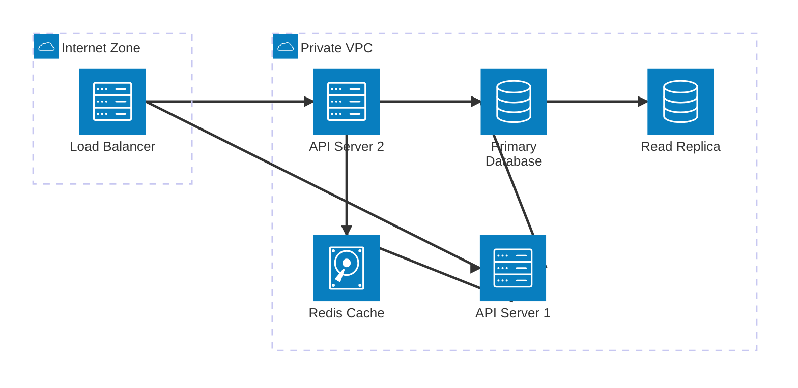
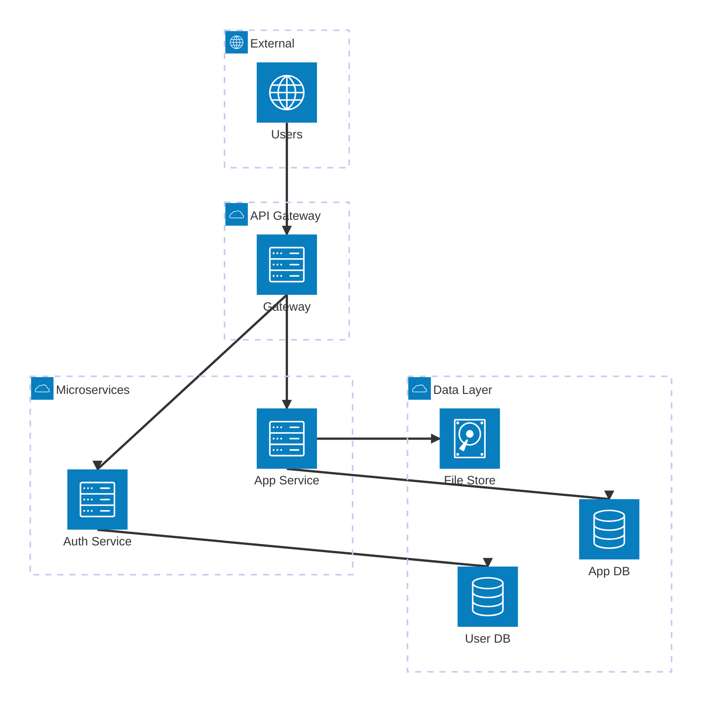
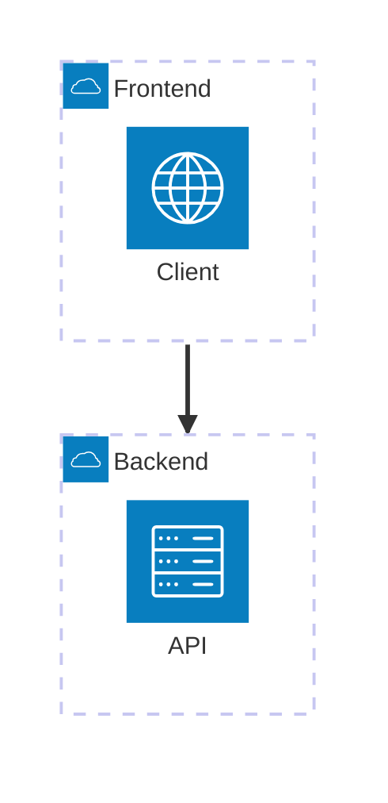

> [!info] Obsidian Integration
> 在 Obsidian 中，直接使用 \`\`\`mermaid 代码块即可渲染图表，无需额外配置。本文档是 [obsidian-md-ac](../SKILL.md) skill 的子参考。

# Architecture Diagrams Reference

Architecture diagrams 用于可视化云服务、CI/CD 部署和基础设施关系。引入于 Mermaid v11.1.0。

> [!warning] Obsidian 兼容性
> - 需要 Obsidian 1.8.3+（Mermaid v11）
> - **仅 5 个默认图标可用**：`cloud`, `database`, `disk`, `internet`, `server`
> - Iconify 图标包（`logos:docker` 等）在 Obsidian 中**不可用**，需要社区插件 obsidian-mermaid-icons
> - 使用不存在的图标名会导致图表**静默失败**，不会显示错误

## Basic Syntax



## Building Blocks

### Groups

将相关服务分组：

```
group {groupId}({icon})[{title}] (in {parentId})?
```



### Services

声明服务节点：

```
service {serviceId}({icon})[{title}] (in {parentId})?
```



### Edges

连接服务：

```
{serviceId}{{group}}?:{T|B|L|R} {<}?--{>}? {T|B|L|R}:{serviceId}{{group}}?
```

**方向：** `T` (上) · `B` (下) · `L` (左) · `R` (右)

**箭头：** `<` 入方向 · `>` 出方向



### Junctions

创建四向分支：

```
junction {junctionId} (in {parentId})?
```



## Icons

### 默认图标（Obsidian 可用）

| Icon | Name | Typical Use |
|------|------|-------------|
| `cloud` | Cloud | Cloud services, API gateways, CDN |
| `database` | Database | SQL/NoSQL databases, data stores |
| `disk` | Disk | File storage, object storage, cache |
| `internet` | Internet | External users, public network |
| `server` | Server | Application servers, load balancers, microservices |

> [!caution] 图标限制
> 在 Obsidian 中**只有上述 5 个图标可用**。使用 `load_balancer`、`api`、`redis` 等自定义名称会导致图表**静默渲染失败**。
>
> **替代策略：** 用 `server` 替代 load balancer/API server，用 `disk` 替代 cache/storage，通过 `[Label]` 标签区分。

### Iconify 图标包（仅 CLI 可用）

如果使用 Mermaid CLI (`mmdc`) 导出 SVG，可安装 iconify 图标包获得 200,000+ 图标：

```bash
npm install @iconify-json/logos @mermaid-js/mermaid-cli
mmdc --iconPacks @iconify-json/logos -i ./diagram.mmd -o ./output.svg
```

常用包：`@iconify-json/logos`（品牌）· `@iconify-json/mdi`（Material Design）· `@iconify-json/simple-icons`

## Complex Example

### 负载均衡架构



### 微服务架构



### CI/CD Pipeline


## Edge Patterns

| Pattern              | Description       |
| -------------------- | ----------------- |
| `A:R -- L:B`         | Horizontal edge   |
| `A:T -- B:B`         | Vertical edge     |
| `A:R --> L:B`        | Edge with arrow   |
| `A:R <--> L:B`       | Bidirectional     |
| `A{group}:R --> L:B` | From group boundary |

## Group Edges

用 `{group}` 修饰符连接分组：



## Best Practices

1. **只用默认图标** — 在 Obsidian 中坚持 `cloud`, `database`, `disk`, `internet`, `server`
2. **用标签区分** — 相同图标通过 `[Label]` 标签说明用途（如 `service cache(disk)[Redis Cache]`）
3. 按环境/层级分组 — public/private 或 frontend/backend
4. 标注协议 — 在标签中说明 HTTPS、TCP 等
5. 用 junction 做扇出 — fan-out 模式
6. 保持聚焦 — 复杂架构拆成多个视图
7. **增量测试** — 每添加几个节点就在 Obsidian 中预览

## Reference

- [Official Documentation](https://mermaid.js.org/syntax/architecture.html)
- [Iconify Icons](https://iconify.design)（仅 CLI 可用）
