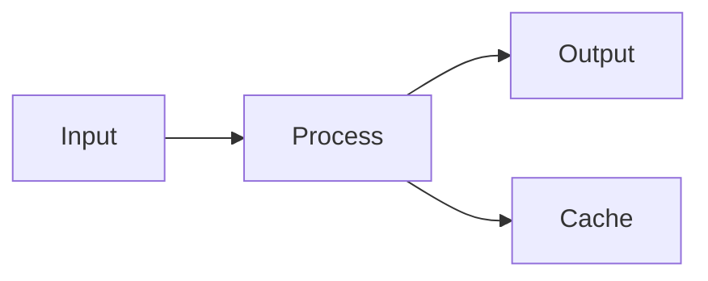

# Obsidian 独有语法参考

本参考**仅涵盖** Obsidian 特有的 Markdown 扩展语法。标准格式（标题、加粗、斜体、列表、引用、基础代码块、基础表格）不在此重复 — Claude 已经熟悉这些。

---

## 高亮

```markdown
==Highlighted text==
```

Obsidian 独有语法，标准 Markdown/GFM 不支持。

---

## Internal Links（Wikilinks）

### 基本链接

```markdown
[[Note Name]]
[[Note Name.md]]
[[Note Name|Display Text]]
```

### 链接到标题

```markdown
[[Note Name#Heading]]
[[Note Name#Heading|Custom Text]]
[[#Heading in same note]]
[[##Search all headings in vault]]
```

### 链接到块

```markdown
[[Note Name#^block-id]]
[[Note Name#^block-id|Custom Text]]
```

定义块 ID — 在段落末尾添加 `^block-id`：

```markdown
This is a paragraph that can be linked to. ^my-block-id
```

列表和引用需要在独立行添加块 ID：

```markdown
> This is a quote
> With multiple lines

^quote-id
```

### 搜索链接

```markdown
[[##heading]]     搜索包含 "heading" 的标题
[[^^block]]       搜索包含 "block" 的块
```

---

## Markdown 风格链接（Obsidian 扩展）

```markdown
[Display Text](Note%20Name.md)
[Display Text](Note%20Name.md#Heading)
[Note](obsidian://open?vault=VaultName&file=Note.md)
```

注意：空格必须 URL 编码为 `%20`。

---

## 嵌入（Embeds）

### 嵌入笔记

```markdown
![[Note Name]]
![[Note Name#Heading]]
![[Note Name#^block-id]]
```

### 嵌入图片

```markdown
![[image.png]]
![[image.png|640x480]]    宽 x 高
![[image.png|300]]        仅宽度（保持比例）
```

### 外部图片（含尺寸）

```markdown


```

### 嵌入音频

```markdown
![[audio.mp3]]
![[audio.ogg]]
```

### 嵌入 PDF

```markdown
![[document.pdf]]
![[document.pdf#page=3]]
![[document.pdf#height=400]]
```

### 嵌入列表

```markdown
![[Note#^list-id]]
```

列表需预先定义块 ID：

```markdown
- Item 1
- Item 2
- Item 3

^list-id
```

### 嵌入搜索结果

````markdown
```query
tag:#project status:done
```
````

---

## Callouts

### 基本 Callout

```markdown
> [!note]
> This is a note callout.

> [!info] Custom Title
> This callout has a custom title.

> [!tip] Title Only
```

### 可折叠 Callout

```markdown
> [!faq]- 默认折叠
> This content is hidden until expanded.

> [!faq]+ 默认展开
> This content is visible but can be collapsed.
```

### 嵌套 Callout

```markdown
> [!question] Outer callout
> > [!note] Inner callout
> > Nested content
```

### 所有 Callout 类型

| Type | Aliases | Description |
|------|---------|-------------|
| `note` | - | Blue, pencil icon |
| `abstract` | `summary`, `tldr` | Teal, clipboard icon |
| `info` | - | Blue, info icon |
| `todo` | - | Blue, checkbox icon |
| `tip` | `hint`, `important` | Cyan, flame icon |
| `success` | `check`, `done` | Green, checkmark icon |
| `question` | `help`, `faq` | Yellow, question mark |
| `warning` | `caution`, `attention` | Orange, warning icon |
| `failure` | `fail`, `missing` | Red, X icon |
| `danger` | `error` | Red, zap icon |
| `bug` | - | Red, bug icon |
| `example` | - | Purple, list icon |
| `quote` | `cite` | Gray, quote icon |

### 自定义 Callout（CSS）

```css
.callout[data-callout="custom-type"] {
  --callout-color: 255, 0, 0;
  --callout-icon: lucide-alert-circle;
}
```

---

## Task Lists

```markdown
- [ ] Incomplete task
- [x] Completed task
- [ ] Task with sub-tasks
  - [ ] Subtask 1
  - [x] Subtask 2
```

---

## 嵌套代码块

用更多反引号包裹外层代码块：

`````markdown
````markdown
Here's how to create a code block:
```js
console.log("Hello")
```
````
`````

---

## 表格中的管道符转义

在表格中使用 wikilinks 或 embeds 时，转义管道符：

```markdown
| Column 1 | Column 2 |
|----------|----------|
| [[Link\|Display]] | ![[Image\|100]] |
```

---

## 数学公式（LaTeX）

### 行内公式

```markdown
This is inline math: $e^{i\pi} + 1 = 0$
```

### 块级公式

```markdown
$$
\begin{vmatrix}
a & b \\
c & d
\end{vmatrix} = ad - bc
$$
```

### 常用语法

```markdown
$x^2$              上标
$x_i$              下标
$\frac{a}{b}$      分数
$\sqrt{x}$         平方根
$\sum_{i=1}^{n}$   求和
$\int_a^b$         积分
$\alpha, \beta$    希腊字母
```

---

## Properties（Frontmatter）

笔记开头的 YAML 元数据：

```yaml
---
title: My Note Title
date: 2024-01-15
tags:
  - project
  - important
aliases:
  - My Note
  - Alternative Name
cssclasses:
  - custom-class
status: in-progress
rating: 4.5
completed: false
due: 2024-02-01T14:30:00
---
```

### 属性类型

| Type | Example |
|------|---------|
| Text | `title: My Title` |
| Number | `rating: 4.5` |
| Checkbox | `completed: true` |
| Date | `date: 2024-01-15` |
| Date & Time | `due: 2024-01-15T14:30:00` |
| List | `tags: [one, two]` 或 YAML list |
| Links | `related: "[[Other Note]]"` |

### 默认属性

- `tags` — 笔记标签
- `aliases` — 笔记的别名
- `cssclasses` — 应用到笔记的 CSS 类

---

## Tags

```markdown
#tag
#nested/tag
#tag-with-dashes
#tag_with_underscores
```

Frontmatter 中：

```yaml
---
tags:
  - tag1
  - nested/tag2
---
```

Tags 可包含：
- 任何语言的字母
- 数字（不能作为首字符）
- 下划线 `_`、连字符 `-`
- 斜杠 `/`（用于嵌套）

---

## 注释（Comments）

```markdown
This is visible %%but this is hidden%% text.

%%
This entire block is hidden.
It won't appear in reading view.
%%
```

---

## 脚注（Footnotes）

```markdown
This sentence has a footnote[^1].

[^1]: This is the footnote content.

You can also use named footnotes[^note].

[^note]: Named footnotes still appear as numbers.

Inline footnotes are also supported.^[This is an inline footnote.]
```

---

## HTML in Obsidian

```markdown
<details>
  <summary>Click to expand</summary>
  Hidden content here.
</details>

<kbd>Ctrl</kbd> + <kbd>C</kbd>
```

---

## 完整示例

````markdown
---
title: Project Alpha
date: 2024-01-15
tags:
  - project
  - active
status: in-progress
priority: high
---

# Project Alpha

## Overview

This project aims to [[improve workflow]] using modern techniques.

> [!important] Key Deadline
> The first milestone is due on ==January 30th==.

## Tasks

- [x] Initial planning
- [x] Resource allocation
- [ ] Development phase
  - [ ] Backend implementation
  - [ ] Frontend design
- [ ] Testing
- [ ] Deployment

## Technical Notes

The main algorithm uses the formula $O(n \log n)$ for sorting.

```python
def process_data(items):
    return sorted(items, key=lambda x: x.priority)
```

## Architecture



## Related Documents

- ![[Meeting Notes 2024-01-10#Decisions]]
- [[Budget Allocation|Budget]]
- [[Team Members]]

## References

For more details, see the official documentation[^1].

[^1]: https://example.com/docs

%%
Internal notes:
- Review with team on Friday
- Consider alternative approaches
%%
````
